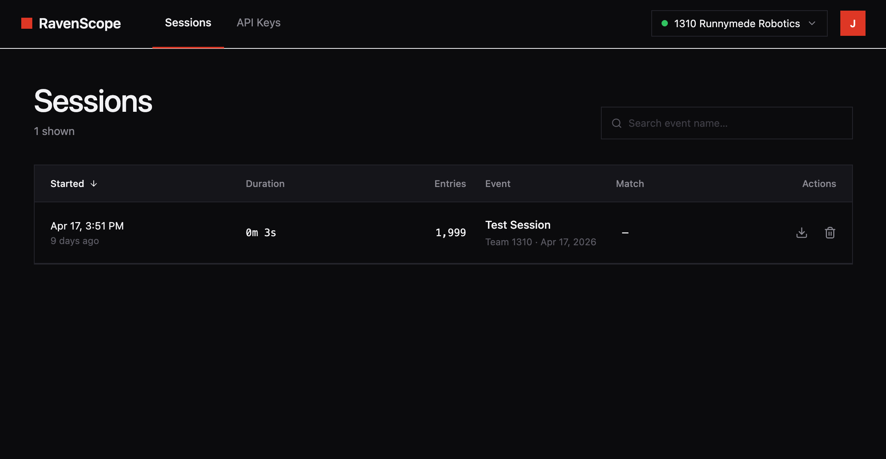
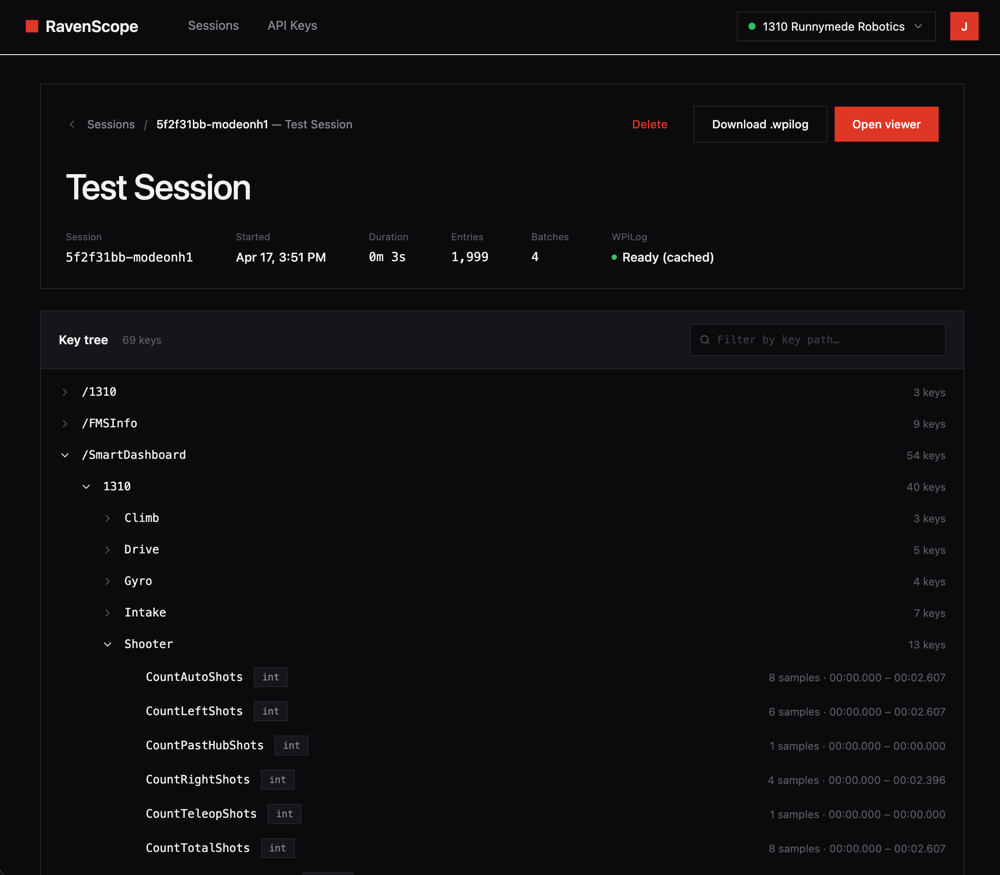
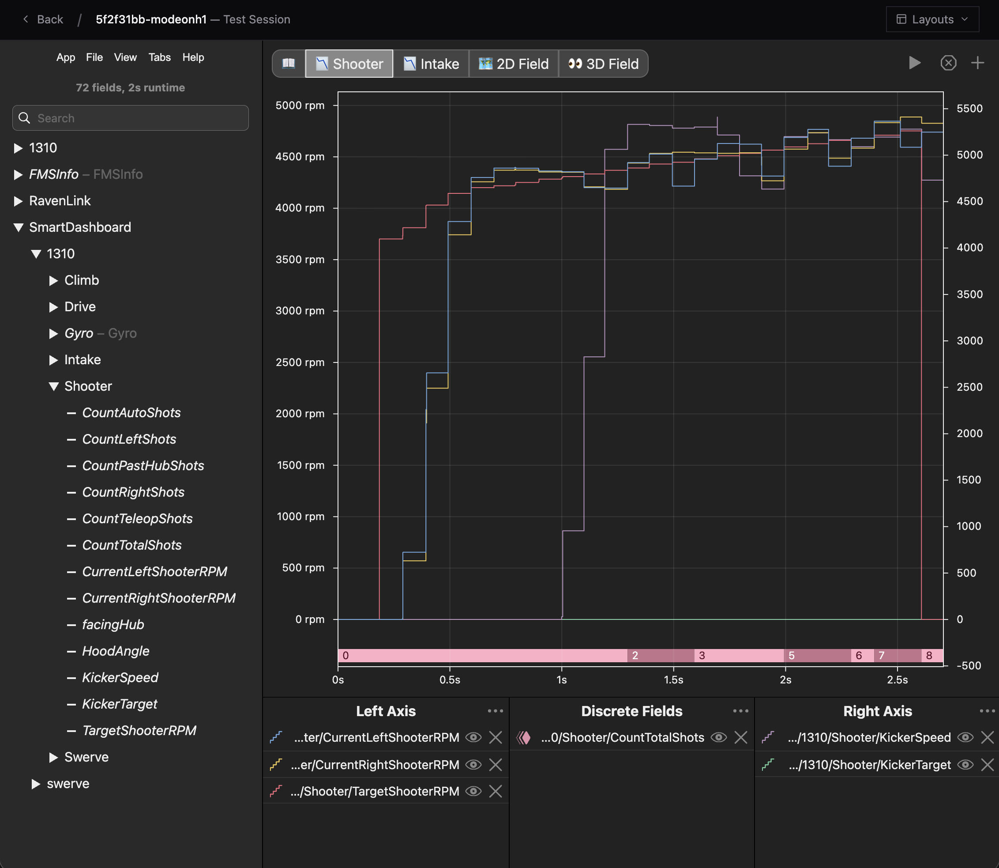

# RavenScope

**Hosted match telemetry for FRC teams.** Sign in with email, mint an
API key, point [RavenLink](https://github.com/RunnymedeRobotics1310/RavenLink)
at it, and your match data lives in a private workspace forever — viewable
in an embedded [AdvantageScope](https://github.com/Mechanical-Advantage/AdvantageScope)
session viewer or downloadable as a `.wpilog`.

No passwords. No database to host. No desktop install. Free for FRC teams.

> Just want to scout matches and view robot data? **[Sign in at
> ravenscope.team1310.ca →](https://ravenscope.team1310.ca)**
>
> Want a richer historical scouting + analysis stack? See
> [RavenBrain](https://github.com/RunnymedeRobotics1310/RavenBrain) — a
> full team-hosted scouting solution.

## Features

- **Magic-link sign-in** — enter your email, click the link, you're in.
- **Workspaces** — each team gets a private workspace. Invite teammates
  by email; they sign in the same way.
- **API keys for ingest** — mint a long-lived bearer key per workspace
  to point a driver-station tool ([RavenLink](https://github.com/RunnymedeRobotics1310/RavenLink))
  at your workspace. Keys are revocable and listed alongside last-used
  timestamps.
- **Session list** — every match shows up automatically with team
  number, FMS event metadata (when present), match level, and start
  time. Search and filter by event or text.
- **Embedded AdvantageScope viewer** — open any session in a full-bleed
  AdvantageScope Lite instance with one click. Line graphs, 3D field,
  joystick, table, console, odometry, mechanism — all the regular
  AdvantageScope tabs, no desktop install.
- **Shared viewer layouts** — save a layout (sidebar, tabs, fields) so
  teammates can load it on any device. Each user picks their own
  default; new teammates auto-default to the team's only layout if
  there is one.
- **`.wpilog` download** — every session can be downloaded as a
  WPILog file for use with the desktop AdvantageScope app or any
  WPILib tool.
- **Audit log** — sign-ins, invites, and ownership changes are
  recorded for accountability.

## What it looks like

**Sessions list — every match your team uploaded, newest first.**

**Session detail — drill into a session's metadata and key tree.**
Open the embedded AdvantageScope viewer, download a `.wpilog`, or
delete the session.

**Embedded AdvantageScope viewer — full-bleed AdvantageScope Lite
in your browser, no desktop install.** Saved layouts apply with one
click; each user picks their own default.

## Getting started

If you only want to view your team's matches, you don't need to install
anything — go to **[ravenscope.team1310.ca](https://ravenscope.team1310.ca)**
and sign in.

If you also want to **send** match data, see the [User Guide](docs/USER-GUIDE.md)
for the full sign-in → workspace → API key → RavenLink flow.

## Who this is for

- **Teams without an existing scouting/analysis stack** who want
  driver-station match data in the cloud with five minutes of setup.
- **Mentors and students on locked-down school laptops** who can't
  install the desktop AdvantageScope app — the embedded viewer needs
  only a browser.
- **Teams who already use RavenLink** and want a hosted endpoint
  without standing up RavenBrain themselves.

## Self-hosting

RavenScope runs on Cloudflare's free tier (Workers, D1, R2, Durable
Objects). If you'd prefer to run your own instance — for data
sovereignty, custom domain, or just because — see
[`docs/DEVELOPMENT.md`](docs/DEVELOPMENT.md) for the deployment
walkthrough.

## Documentation

- **[User Guide](docs/USER-GUIDE.md)** — sign in, set up your
  workspace, invite teammates, point RavenLink at your workspace, view
  and share layouts.
- **[Development & Self-Hosting](docs/DEVELOPMENT.md)** — repo layout,
  local development, Cloudflare deployment, security model,
  AdvantageScope bundle bumps.
- **[Attribution](ATTRIBUTION.md)** — third-party software
  redistributed in this project (AdvantageScope and asset bundles).

## License

[BSD-3-Clause](LICENSE). Embeds AdvantageScope (also BSD-3-Clause); see
[`ATTRIBUTION.md`](ATTRIBUTION.md) for the full notice.
