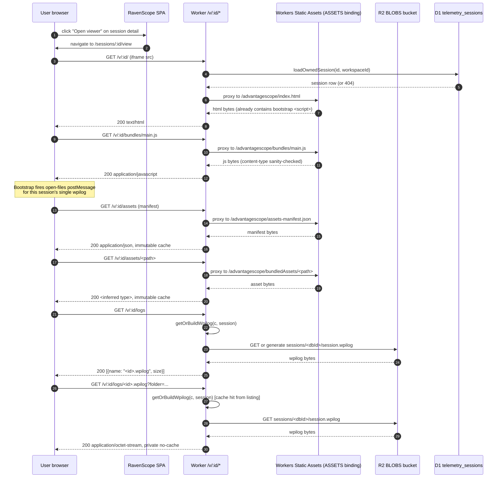

# feat: Embed AdvantageScope Lite in RavenScope web UI

## Overview

Embed the browser-runnable variant of AdvantageScope (AdvantageScope Lite, BSD-3,
shipped under `lite/static/` in the AdvantageScope repo) inside the RavenScope
web UI so users can open a RavenScope session's WPILog in a full-featured viewer
with one click — no desktop install, no separate download.

The entire embed is built on two observations:

1. AS Lite's frontend only needs four HTTP endpoints from its host (`/assets`,
   `/assets/<p>`, `/logs`, `/logs/<name>`), and its fetches are all **relative**.
   This means the whole app can be scoped to a path prefix we control.
2. Mounting Lite under `/v/:id/*` lets the Worker treat `:id` as both URL scope
   and session identity — every dynamic handler knows which session it's serving
   without any extra routing param, postMessage handshake, or signed URL.

---

## Problem Frame

Today, the only way to visualize a RavenScope session's telemetry is "Download
.wpilog → open in desktop AdvantageScope." That works, but it requires every
teammate who wants to look at post-match data to install the Electron app.
Mentors on phones, students on locked-down school laptops, scouting tablets —
these users either install nothing or have no option.

The fix is to expose the viewer *inside* the web app. Building our own is
multi-month; AdvantageScope already has a browser variant. We ship that.

See origin: `docs/brainstorms/2026-04-23-001-feat-embed-advantagescope-requirements.md`.

---

## Requirements Trace

- R1. One click from a session detail page lands the user in a fully functional
  AdvantageScope view of that session's data, with no additional login, no
  download, no install. (origin success criterion 1)
- R2. Line graph, 3D field, table, console, odometry, mechanism, and joystick
  tabs render correctly out of the box for a session whose WPILog contains the
  typical signals RavenLink emits. (origin success criterion 2)
- R3. The AdvantageScope bundle upgrade workflow is a single command
  (`pnpm fetch:advantagescope`) plus a commit, reproducible in CI, no manual
  file copy. (origin success criterion 3)
- R4. No AdvantageScope source files in the RavenScope repo. Only the pinned
  tag, the install script, a small bootstrap patch (if used), and
  `ATTRIBUTION.md`. (origin success criterion 4)
- R5. Auth enforcement on `/v/:id/*` is byte-identical to the policy on
  `/api/sessions/:id/wpilog` — a non-owner gets 404 on the iframe endpoints,
  and the embedded AS instance simply shows its own "file not found" state.
  (origin success criterion 5)
- R6. No measurable impact on RavenScope cold-start time. (origin success
  criterion 6)

---

## Scope Boundaries

- No per-team custom asset upload UI in this plan (explicitly deferred in
  origin — will ship a later phase once v1 lands and usage signals demand it).
- No multi-session merge through the embedded viewer. `/v/:id/logs` always
  returns one file: the session in the URL.
- No deep-linking to a specific AS tab, field, or timestamp. That would need a
  larger URL contract (upstream change ideal).
- No live / realtime NT4 streaming into the viewer. Session is complete by the
  time the user views it — historical data source only.
- No video tab, Phoenix Diagnostics, Hoot format, AdvantageScope XR, pop-out
  windows, or tab-layout JSON export. These are documented omissions of AS
  Lite and we inherit them.
- No general "upload-any-WPILog-and-view-it" surface. RavenScope embeds Lite
  *for RavenScope sessions* — not as a generic log host. (origin: "Outside
  this product's identity")

### Deferred to Follow-Up Work

- **Upstream contribution of `?log=&folder=` URL-param auto-open to AS Lite.**
  Worth opening an issue with the Mechanical-Advantage team once v1 ships, so
  the bootstrap-script shim (U1, U6) can eventually be dropped. Separate
  effort, not in this plan.
- **Institutional-learnings captures.** Several decisions here (same-origin
  iframe posture, install-time artifact fetch + checksum pattern, BSD-3
  attribution convention) are strong candidates for the team's first entries
  in a `docs/solutions/` store. Deferred to a follow-up chore.

---

## Context & Research

### Relevant Code and Patterns

- `packages/worker/src/routes/wpilog.ts` — the route whose auth posture and
  R2 streaming pattern `/v/:id/logs/<name>` must replicate byte-for-byte.
  Workspace-scoped auth (not user-scoped): `and(eq(sessions.id, id),
  eq(sessions.workspaceId, user.workspaceId))`. Cache-Control is
  `private, max-age=0, must-revalidate`.
- `packages/worker/src/routes/sessions.ts` — five more instances of the same
  inline workspace-scope pattern; candidate for helper extraction (U4).
- `packages/worker/src/storage/r2.ts` — the single choke point for all R2 I/O.
  Every op is wrapped in `chargeOrThrow` for quota accounting (Class A/B ops,
  bytes). Transparent gzip on write/read via `gzipEncode` /
  `readPlainBlobStream`. Follow this module for the new asset handler.
- `packages/worker/src/storage/keys.ts` — key-prefix helpers
  (`wpilogKey`, `batchKey`, etc.). Add `advantagescopeAssetKey(version, path)`.
- `packages/worker/src/auth/require-cookie-user.ts` + `auth/user.ts` — the
  Hono middleware chain the new route group mounts under. `ContextVariableMap`
  augmentation exposes `c.var.user`.
- `packages/worker/src/index.ts:13–` — route registration pattern. Sub-apps
  declared as `new Hono<{ Bindings: Env }>()` per feature, mounted via
  `app.route(prefix, subApp)`.
- `packages/worker/wrangler.toml:6–15` — Workers Static Assets config; SPA
  fallback; `run_worker_first = ["/api/*"]`. Must become
  `["/api/*", "/v/*"]`.
- `packages/web/src/routes/session-detail.tsx:89–91` — where the "Open
  viewer" button slots in next to "Download .wpilog".
- `packages/web/src/app.tsx:21–32` — React Router v6 route table; `AuthGate`
  wrap pattern for protected routes.
- `packages/web/src/lib/api.ts:109` — `sessionDownloadUrl(id)` helper;
  parallel helper `sessionViewerUrl(id)` follows the same convention.
- `scripts/setup.sh` — shebang-bash style and R2 bucket verification precedent
  (confirms "no public R2" is actively enforced).

### Institutional Learnings

- `docs/solutions/` does not exist yet; this feature is greenfield for
  institutional knowledge on AS embed, install-time artifact fetch, and
  Workers static-asset posture. Capture these after v1 lands.

Adjacent context surfaced during research:
- `docs/plans/2026-04-17-001-feat-ravenscope-greenfield-plan.md:25, 65, 132,
  295, 333` — AS integration was explicitly deferred in the greenfield plan;
  this plan is the "embedded web-port" branch of that decision.
- `README.md:134` — hard convention: R2 has no public access, no `r2.dev`
  subdomain, no custom public domain. All R2 reads go through the Worker.
  Drives the Worker-proxy static posture in U6.

### External References

- AdvantageScope Lite docs:
  `~/src/1310/AdvantageScope/docs/docs/more-features/advantagescope-lite.md`
  (omissions we inherit: no video tab, no Hoot, no XR, no pop-out, no layout
  JSON export).
- AdvantageScope Lite HTTP contract:
  `~/src/1310/AdvantageScope/lite/lite_server.py` — the four endpoints we're
  re-implementing, plus the static-asset serve pattern.
- AdvantageScope Lite frontend fetch call sites:
  `~/src/1310/AdvantageScope/src/main/lite/main.ts:194, 219, 336` — the
  `open-files` postMessage shape the U1 spike bootstrap script must dispatch.
- Default FRC asset bundle:
  `https://github.com/Mechanical-Advantage/AdvantageScopeAssets/releases/download/bundles-v1/AllAssetsDefaultFRC.zip`.

---

## Key Technical Decisions

- **Worker-proxy posture for Lite's static files.** Every request to
  `/v/:id/*` runs through the Worker, including JS/CSS/HTML. For the four
  dynamic paths the Worker returns session-scoped data; for everything else
  the Worker authorizes `:id` and then proxies to
  `env.ASSETS.fetch(new Request(origin + "/advantagescope" + rest))`.
  Rationale: makes R5 (byte-identical auth) literal. Alternative "serve Lite
  from `/advantagescope/` directly and only gate `/v/:id/{logs,assets}`"
  leaves Lite's JS loadable without auth, which is fine in practice but drifts
  from the success-criterion language. Cost of proxy is sub-ms; no measurable
  impact on R6.
- **Content-type sanity check on the static proxy.** `wrangler.toml:9` sets
  `not_found_handling = "single-page-application"`, and this setting is
  inherited by `env.ASSETS.fetch()` calls — a missing path under
  `/advantagescope/...` would return RavenScope's SPA `index.html` with
  HTTP 200, which Lite would then attempt to execute as JS in a hard-to-
  diagnose way. The static proxy handler inspects the response's
  `Content-Type` (and the upstream request's expected extension) and
  returns 404 when they disagree (e.g., text/html for a `.js` request).
  Pattern is new to this repo; introduce with a short comment.
- **Lite bundle ships via Workers Static Assets, not R2.** AS's
  `bundleLiteAssets.mjs` populates `lite/static/bundledAssets/` (default
  FRC fields, joysticks, example robots) during the Lite build itself. Once
  we vendor the *built* `lite/static/**` tree into
  `packages/web/public/advantagescope/`, the default assets are already
  present — served by Workers Static Assets alongside the JS/CSS. This
  collapses the originally-planned R2 asset upload. Consequence: deploys
  are atomic (no mid-session version skew across isolates), and the
  `/v/:id/assets[/*]` handlers delegate to `env.ASSETS.fetch()` the same
  way as the static catch-all.
- **Lite build output comes from a developer ritual + RavenScope-owned GH
  release, not from an upstream AS release asset.** AS does not publish
  `lite/static/**` as a downloadable release asset; their Lite artifact is
  a Systemcore `.ipk` produced only as an expiring GitHub Actions workflow
  artifact. RavenScope therefore owns the build-and-publish step: a
  developer with a local AS clone at a pinned tag runs
  `pnpm publish:advantagescope-bundle` (which invokes AS's own build
  pipeline: `npm ci && ASCOPE_DISTRIBUTION=LITE npm run compile && npm run
  docs:build-embed`) and uploads the resulting tarball to a RavenScope
  GitHub release (e.g., `advantagescope-lite-v27.1.0.tar.gz`). `pnpm
  fetch:advantagescope` then downloads from *RavenScope's* stable release
  URL — not from AS's. This preserves the origin doc's "don't replicate
  the whole repo" constraint (no AS source in RavenScope) while giving CI
  a stable, non-expiring download target. Alternatives considered:
  committing the built `lite/static/**` into RavenScope (rejected: bloats
  git history by ~few MB per version bump); git submodule + build in CI
  (rejected: drags AS's full toolchain into RavenScope CI including
  Emscripten); fetching AS workflow artifacts via GitHub API (rejected:
  90-day expiry, requires auth token).
- **Install-time fetch, not `postinstall`.** Adding a `postinstall` hook
  would hit GitHub on every `pnpm install --frozen-lockfile` in CI and
  every fresh clone. Instead, an explicit `pnpm fetch:advantagescope`
  script (developer runs once per version bump; CI runs it as a pre-build
  step). The downloaded `packages/web/public/advantagescope/` tree is
  `.gitignore`d — reproducible from the pinned tag, not committed.
- **Bootstrap script produced by U1 spike, committed only after U1 returns
  green.** The spike validates whether AS Lite's `open-files` postMessage
  is reachable from an injected module-script. Only after that outcome is
  known does U2 commit the finalized `bootstrap.js`. If U1 shows the
  accessor is module-closure-scoped and unreachable, the plan's fallback
  is a tiny `patch(1)`-applied diff against `src/main/lite/main.ts`
  maintained alongside `version.txt` — the publish script from U2b applies
  it during the AS build. Upstream contribution of `?log=&folder=` remains
  the long-term fix.
- **Workspace-scoped auth, matching existing routes.** Non-owner gets 404
  `not_found`, not 403. Mirrors `packages/worker/src/routes/wpilog.ts:38`
  exactly. Extract `loadOwnedSession(c, id)` helper in U4 so all six call
  sites (existing 5 + new) share one line.
- **Factor `getOrBuildWpilog` out of `routes/wpilog.ts`.** `/v/:id/logs/<name>`
  must stream the same cached bytes as `/api/sessions/:id/wpilog`. Extract
  the cache-check + generate-on-miss body into a reusable helper (U5) so
  policy drift is structurally impossible.
- **Iframe sandbox posture:
  `sandbox="allow-scripts allow-same-origin"` only.** `allow-same-origin`
  is required for the session cookie to flow on Lite's relative fetches
  (same-origin fetches send SameSite=Lax cookies automatically). The
  combination does grant Lite's JS access to RavenScope's `localStorage`,
  `sessionStorage`, and the ability to `window.parent.postMessage(...)` —
  RavenScope does not register a parent-frame `message` listener, and the
  session cookie is `HttpOnly` (`packages/worker/src/auth/cookie.ts:140`)
  so it cannot be read from JS. `allow-downloads` is intentionally omitted
  (AS Lite's export flows are not required for v1). If a future RavenScope
  feature adds a parent-window message listener, the iframe becomes an
  attack surface that must be hardened with an origin check.

---

## Open Questions

### Resolved During Planning

- **How does Lite's main window wire up the `open-files` message?** Via
  `hubPort` (MessagePort) set up during app boot in `src/main/lite/main.ts`.
  The bootstrap script must access the same port. Exact accessor TBD by the
  U1 spike. If `hubPort` is closure-scoped and unreachable from an injected
  module-script, fallback is a tiny `patch(1)`-applied diff to `main.ts`
  applied by the publish script (U2b) during the AS build.
- **Which auth unit does the workspace scope hang off of?** `workspaceId`, not
  `userId`. Verified against `packages/worker/src/routes/wpilog.ts:31–36`.
- **Where do Lite's static files live at rest?** Workers Static Assets under
  `packages/web/public/advantagescope/` (Vite copies `public/**` into
  `dist/`, which wrangler uploads via the `ASSETS` binding). Not in the
  Worker script bundle — no impact on the 10 MiB script cap.
- **Where does the AS Lite build output come from?** From a RavenScope-owned
  GitHub release, populated by a developer ritual (U2b,
  `pnpm publish:advantagescope-bundle`) that runs AS's own build pipeline
  against a pinned tag in a local AS checkout. AS does not publish
  `lite/static/**` as a release asset; relying on their CI `.ipk`
  workflow-artifact is infeasible (90-day expiry, auth-gated). See Key
  Technical Decisions for full rationale.
- **Where do the default FRC assets come from?** From AS's own
  `bundleLiteAssets.mjs`, which runs as part of AS's `postinstall` during
  the U2b build step. The assets land in `lite/static/bundledAssets/` and
  ship alongside Lite's JS as part of the tarball. No separate R2 upload
  is needed. The originally-planned `bundles-v1/AllAssetsDefaultFRC.zip`
  download is *not* used — AS Lite's runtime expects assets from
  `archive-v1`-tagged individual zips that `bundleLiteAssets.mjs` has
  already consumed, and mixing the two sources would risk version skew.
- **Should the `/v/:id/` route rewrite Lite's `index.html` on the fly or
  inject the bootstrap at install time?** Install time (during the
  publish-bundle build, U2b). Simpler and keeps the Worker hot path free
  of HTML parsing.
- **What happens when `env.ASSETS.fetch()` is called for a path that
  doesn't exist?** Returns RavenScope's SPA `index.html` with HTTP 200
  because of `not_found_handling = "single-page-application"` — NOT 404.
  U6's static-proxy handler guards against this by content-type sanity-
  checking the response before forwarding.

### Deferred to Implementation

- **Exact mechanism of the bootstrap postMessage dispatch.** Depends on what
  AS Lite's main window exposes at boot. U1 resolves this via a spike against
  the pinned AS release tag.
- **Whether Lite's bundled `lite/static/bundledAssets/` needs to re-upload to
  R2 on every AS version bump, or whether a content-hash cache saves work.**
  Deferred — first version: always re-upload. Optimize later if the friction
  is real.
- **Final CSP for the viewer route.** React SPA already has a CSP posture;
  the iframe sub-frame needs `frame-src 'self'` at minimum, possibly
  `worker-src 'self' blob:` depending on how Lite loads its workers.
  Determine by running the viewer and watching for CSP violations.
- **Asset `/assets` manifest shape.** Lite's Python reference serves a JSON
  map of `filename -> config.json contents (or null)`. Faithfully reproduce;
  discover the exact schema by running Lite against a tiny asset set and
  comparing to the Python response.

---

## High-Level Technical Design

> *This illustrates the intended request flow and is directional guidance for
> review, not implementation specification. The implementing agent should
> treat it as context, not code to reproduce.*



---

## Implementation Units

- [ ] U1. **Spike: AS Lite bootstrap auto-open**

**Goal:** De-risk the bootstrap-script approach end to end before committing
to U6's design. Produce a tiny HTML file that, when injected into a locally-
served copy of AS Lite's `index.html`, successfully causes AS Lite to open a
single pre-known log without any user interaction.

**Requirements:** R1 (one-click open).

**Dependencies:** None.

**Files:**
- Create (throwaway / not committed): a local spike dir outside the RavenScope
  repo, or a branch of `packages/web/public/advantagescope-spike/` that is
  removed before merge.
- Reference: `~/src/1310/AdvantageScope/src/main/lite/main.ts:185–228` (the
  download popup → `open-files` flow we're mimicking).

**Approach:**
- Download the pinned AS release's Systemcore artifact; extract `lite/static/`
  locally. Stand up a trivial static server (or the included `lite_server.py`).
- Append a `<script type="module">` to `index.html` that:
  1. Waits for DOMContentLoaded.
  2. Inspects what Lite's main.ts exposes globally at boot (likely `hubPort`
     via a shared module or `window`-attached handle) and finds the right
     channel to dispatch `open-files`.
  3. Dispatches: `sendMessage(hubPort, "open-files", { files: [{name, size}],
     merge: false })`, using a faked `name`+`size` matching what the server
     will answer for.
- Fake the server: have `/logs` return `[{ name: "demo.wpilog", size: N }]`,
  `/logs/demo.wpilog` return a checked-in sample WPILog.
- Validate that AS Lite boots, skips the File-Download popup entirely, and
  lands on the hub with the sample log loaded and fields populated.
- Document findings in a short note in the plan's Deferred-to-Implementation
  section (update the plan in place) or a scratchpad that feeds U6.

**Execution note:** Spike only. No RavenScope code changes. If the approach
doesn't work cleanly, revise the plan (U6 falls back to a patched `main.ts`
applied by the fetch script, or to contributing a URL-param upstream and
blocking on that).

**Patterns to follow:**
- The download-popup message flow in `main.ts:185–228`. Our bootstrap is the
  popup's logical "save" click, minus the UI.

**Test scenarios:**
- Happy path: with the bootstrap script present, visiting `index.html` auto-
  loads the sample log, hub renders the line-graph and table tabs populated.
- Error path: if `/logs/demo.wpilog` is not present, AS Lite surfaces its own
  file-not-found state and does not crash.
- Edge case: the bootstrap runs a second time after the hub has already
  loaded (e.g., iframe reload) — no duplicate merge, no console errors.

**Verification:**
- A reproducible local demo where opening `index.html` results in a fully-
  loaded AS Lite hub viewing the sample log, with zero clicks after page
  load.
- A clear decision recorded in the plan (or a comment in U6) on the exact
  accessor/channel used, so U6 can implement the injection without re-
  discovering it.

---

- [ ] U2. **Install-time fetch script (`pnpm fetch:advantagescope`)**

**Goal:** One command pulls a pre-built AS Lite bundle tarball from a
RavenScope-owned GitHub release into
`packages/web/public/advantagescope/`. Deterministic per pinned tag;
reproducible on a fresh clone and in CI. No AS source tree involved.

**Requirements:** R3 (one-command upgrade), R4 (no AS source in repo).

**Dependencies:** U1 (the exact bootstrap-script shape is baked into the
tarball by U2b; U1's outcome determines whether U2b also applies a
`main.ts` patch).

**Files:**
- Create: `packages/web/scripts/fetch-advantagescope.mjs`
- Create: `packages/web/advantagescope/version.txt` — pinned AS release tag
  plus the matching RavenScope-bundle tag (format TBD, e.g.
  `as=v27.1.0 bundle=advantagescope-lite-v27.1.0`). Committed.
- Create: `packages/web/advantagescope/checksums.txt` — SHA-256 of the
  expected tarball. Committed, updated by U2b during each version bump.
- Modify: `packages/web/package.json` — add `"fetch:advantagescope"`
  script.
- Modify: `.gitignore` — ignore `packages/web/public/advantagescope/` and
  `packages/web/.advantagescope-cache/`.
- Test: `packages/web/scripts/fetch-advantagescope.test.mjs` — pure-Node
  test of the script's pure functions (version-file parsing, tarball
  extraction path-safety, checksum verification). Network calls are
  mocked.

**Approach:**
- Script reads the pinned tags from `version.txt` and the expected SHA-256
  from `checksums.txt`.
- Downloads
  `https://github.com/<ravenscope-org>/<repo>/releases/download/<bundle-tag>/<bundle-tag>.tar.gz`
  to `.advantagescope-cache/<bundle-tag>/`. Skip re-download if cached
  tarball matches the pinned checksum.
- Verifies SHA-256 of the downloaded tarball against `checksums.txt`;
  aborts with a clear error on mismatch.
- Extracts the tarball to `packages/web/public/advantagescope/`.
  **Path-safety:** reject any entry whose resolved path escapes the target
  directory (zip-slip / tar-slip guard).
- The tarball already contains `index.html` with the bootstrap `<script>`
  tag injected, `bootstrap.js` next to it, and the full
  `bundledAssets/` tree with default FRC assets (produced by U2b during
  the AS build). No post-extraction patching in U2.
- Stale-file cleanup: remove the target dir before extracting, so old
  assets from a previous bundle version don't linger.

**Patterns to follow:**
- `scripts/seed-sample-session.mjs` — Node ESM script style.
- Prettier config (`/.prettierrc.json`): no semis, double quotes, 100-col,
  trailing commas.

**Test scenarios:**
- Happy path: given a pinned version + checksum, script downloads the
  tarball, verifies checksum, extracts into
  `packages/web/public/advantagescope/`, and `index.html` contains the
  bootstrap `<script>` tag (verifies the bundle was built correctly by
  U2b).
- Edge case: script is run twice; second run is a noop (no redundant
  download if cached tarball matches checksum).
- Error path: tar entry with `../` in its path is rejected; no file is
  written outside the target directory.
- Error path: checksum mismatch triggers an abort with a descriptive
  message; target dir is not left in a half-extracted state.
- Edge case: target dir already exists with stale files from a previous
  version — stale files are cleaned out before extraction.
- Error path: GitHub 404 on the release URL (e.g., typo in
  `version.txt`) produces a clear error pointing the user at U2b.

**Verification:**
- Running `pnpm fetch:advantagescope` on a clean clone populates
  `packages/web/public/advantagescope/` with `index.html` (bootstrap
  injected), `bundles/main.js`, `www/hub.html`, and `bundledAssets/**`.
- `pnpm build` (web) succeeds with those files in place; output under
  `packages/web/dist/advantagescope/` matches the input.

---

- [ ] U2b. **AS Lite bundle build-and-publish script**

**Goal:** Developer ritual (run once per AS version bump, not on every
build) that uses a local AS clone at a pinned tag to produce the tarball
U2 downloads. Output is a RavenScope GitHub release asset plus an updated
`checksums.txt` + `version.txt` committed to the repo.

**Requirements:** R3 (reproducible upgrade), R4 (no AS source in
RavenScope repo).

**Dependencies:** U1 (determines whether a `main.ts` patch is applied
during the AS build).

**Files:**
- Create: `packages/web/scripts/publish-advantagescope-bundle.mjs` — the
  build-and-upload workflow.
- Create: `packages/web/advantagescope/bootstrap.js` — RavenScope-authored
  bootstrap, committed, <2 KB, the finalized output of U1.
- Create: `packages/web/advantagescope/main.ts.patch` *(only if U1 shows
  the bootstrap cannot reach `hubPort` without source modification)* —
  tiny `patch(1)`-compatible diff applied during the AS build.
- Modify: `packages/web/package.json` — add
  `"publish:advantagescope-bundle"` script.
- Modify: `README.md` — document the version-bump ritual.

**Approach:**
- Script takes `AS_PATH` env var pointing at a local AS clone; refuses to
  run if not provided. Reads the target AS tag from `version.txt`.
- Runs inside the AS clone: `git fetch && git checkout <tag>`, then
  `npm ci` (which runs AS's `postinstall` and thus
  `bundleLiteAssets.mjs`, populating `bundledAssets/`), then `npm run
  wasm:compile`, then `ASCOPE_DISTRIBUTION=LITE npm run compile`, then
  `npm run docs:build-embed`.
- If `main.ts.patch` exists, applies it before `compile`.
- Copies `bootstrap.js` into `AS/lite/static/bootstrap.js` and injects a
  single `<script type="module" src="bootstrap.js"></script>` line into
  `AS/lite/static/index.html` just before `</body>`.
- Tars the resulting `AS/lite/static/**` into
  `.advantagescope-cache/<bundle-tag>.tar.gz`.
- Computes SHA-256 and writes it to
  `packages/web/advantagescope/checksums.txt`.
- Uses `gh release create` (or `gh release upload` if the release already
  exists) to publish the tarball to a RavenScope-owned release. The
  `gh` CLI is already part of the developer toolkit for this repo (PRs
  are created with it).
- Prints the final tag + URL; developer commits `version.txt` and
  `checksums.txt`.

**Patterns to follow:**
- `scripts/setup.sh` — one-shot, developer-driven, shell out to external
  CLI tools (`wrangler`, `gh`), verify state before acting.
- Node `child_process` `execFileSync` with inherited stdio for long-running
  sub-commands (npm install, rollup compile). No shell strings.

**Test scenarios:**
- Test expectation: none — this is a developer ritual that runs against
  real AS code and real GitHub API. Correctness is verified end-to-end
  by U2 pulling the resulting tarball back down and U6's integration
  tests loading it.

**Verification:**
- Running `AS_PATH=... pnpm publish:advantagescope-bundle` against a
  pinned AS tag produces a RavenScope release with a tarball attached,
  and updates `checksums.txt`. After committing, `pnpm
  fetch:advantagescope` on a clean clone pulls that tarball and
  populates `packages/web/public/advantagescope/` as expected.
- The first successful end-to-end pass of U7 (manually open the viewer
  in a browser) against the v1 bundle constitutes the end-to-end
  verification of the whole U2b → U2 → U6 → U7 pipeline.

---

- [ ] U4. **Extract `loadOwnedSession` auth helper**

**Goal:** Replace the inlined workspace-scoped session SELECT repeated 5×
across `routes/sessions.ts` and `routes/wpilog.ts` with a single helper.
Same behavior, same error shape (404 `not_found`), byte-identical auth.

**Requirements:** R5 (auth byte-identical to `/api/sessions/:id/wpilog` on
the new routes).

**Dependencies:** None.

**Files:**
- Create: `packages/worker/src/auth/session-owner.ts`
- Create: `packages/worker/src/auth/session-owner.test.ts`
- Modify: `packages/worker/src/routes/wpilog.ts` (replace inline SELECT).
- Modify: `packages/worker/src/routes/sessions.ts` (replace 4 inline SELECTs).

**Approach:**
- Export `loadOwnedSession(c: Context<{ Bindings: Env }>, id: string):
  Promise<SessionRow | null>` that:
  1. Calls `requireCookieKind(c.var.user)`.
  2. Runs the existing `db.select().from(telemetrySessions).where(and(
     eq(telemetrySessions.id, id),
     eq(telemetrySessions.workspaceId, user.workspaceId))).limit(1)` query.
  3. Returns the row or `null`.
- Each call site becomes:
  ```
  const session = await loadOwnedSession(c, id)
  if (!session) return c.json({ error: "not_found" }, 404)
  ```
- JSDoc block explains invariants: workspace-scoped, not user-scoped; never
  throws on missing; caller must 404 on null to preserve existing behavior.

**Execution note:** Characterization-first. Write the helper's test alongside
the refactor; rerun the existing `routes/wpilog.test.ts` and
`routes/sessions.test.ts` to confirm behavior is byte-identical.

**Patterns to follow:**
- `packages/worker/src/auth/require-cookie-user.ts` — module organization
  (single exported function, JSDoc invariants block).

**Test scenarios:**
- Happy path: session exists in caller's workspace → returns the row.
- Error path: session exists but belongs to a different workspace → returns
  `null`.
- Error path: session does not exist → returns `null`.
- Edge case: `id` is an empty string or malformed → returns `null` (no
  throw).
- Integration: the existing `routes/wpilog` tests still pass without
  modification after the refactor.

**Verification:**
- `grep` across `packages/worker/src/routes/` finds zero remaining inline
  instances of
  `eq(telemetrySessions.workspaceId` except in the helper itself.
- `pnpm -F @ravenscope/worker test` is green.

---

- [ ] U5. **Extract `getOrBuildWpilog` helper**

**Goal:** Factor the cache-check + generate-on-miss body out of the existing
`/api/sessions/:id/wpilog` route so the new `/v/:id/logs/<name>` handler can
reuse it verbatim. Policy drift between the two paths must be structurally
impossible.

**Requirements:** R5 (byte-identical behavior between the two viewing paths).

**Dependencies:** U4.

**Files:**
- Create: `packages/worker/src/wpilog/get-or-build.ts`
- Create: `packages/worker/src/wpilog/get-or-build.test.ts`
- Modify: `packages/worker/src/routes/wpilog.ts` — the route handler becomes
  a thin shell calling `getOrBuildWpilog(c, session)` and wrapping the result
  in the response headers (`Content-Type`, `Content-Disposition`,
  `Cache-Control`).

**Approach:**
- `getOrBuildWpilog(c, session)` returns either `{ stream, bytes, isCached:
  boolean }` or throws a typed error (already-handled upstream patterns:
  `QuotaExceededError` → `handleQuotaExceeded`).
- Logic lifted from `routes/wpilog.ts:47–93`: check `session.wpilogKey` +
  `session.wpilogGeneratedAt` against the cache-mark; if hit, `classB: 1`
  charge and read from R2; if miss, regenerate + write + update D1.
- Caller is responsible for wrapping in `Response` with headers, so the two
  callers can set different `Content-Disposition` (`attachment` vs no
  attachment) while sharing the cache policy.

**Execution note:** Characterization-first. The extraction is pure refactor;
the existing wpilog response bytes must remain byte-identical, verified by
the existing golden-file regression test.

**Patterns to follow:**
- `packages/worker/src/storage/r2.ts` — wrapping I/O ops with
  `chargeOrThrow`, streaming responses from R2 bodies.

**Test scenarios:**
- Happy path (cache hit): session has a recent `wpilogKey` and
  `wpilogGeneratedAt`; helper returns the R2-cached stream, charges one
  Class B, does not touch the generator.
- Happy path (cache miss): session has no `wpilogKey`; helper runs the
  generator, writes to R2, updates D1, returns the freshly-generated stream.
- Happy path (stale cache): `wpilogGeneratedAt` is older than session's most
  recent ingest batch; helper treats as miss.
- Error path: `QuotaExceededError` from R2 propagates and is recognizable by
  the caller.
- Integration: existing `routes/wpilog` tests + the golden-file byte-
  identical test both pass.

**Verification:**
- `pnpm -F @ravenscope/worker test` is green.
- `routes/wpilog.ts` is ~15 lines shorter and contains no inline R2 ops;
  all heavy lifting lives in `wpilog/get-or-build.ts`.

---

- [ ] U6. **New Worker route group `/v/:id/*` + wrangler wiring**

**Goal:** The four session-scoped dynamic handlers plus the static-proxy
catch-all, all under one auth gate. Plus the critical `wrangler.toml`
change so SPA fallback doesn't eat the route.

**Requirements:** R1, R2, R5, R6.

**Dependencies:** U1, U2 (static files must exist on disk for
`env.ASSETS.fetch` to resolve), U4, U5. (U3 no longer exists; asset
storage moved to Workers Static Assets alongside Lite's JS/CSS.)

**Files:**
- Create: `packages/worker/src/routes/advantagescope.ts`
- Create: `packages/worker/src/routes/advantagescope.test.ts`
- Modify: `packages/worker/src/index.ts` — register the new route group:
  `app.route("/v", advantagescopeRoutes)`. Order: after `httpsOnly`,
  alongside `/api/*` registrations.
- Modify: `packages/worker/wrangler.toml` — `run_worker_first = ["/api/*",
  "/v/*"]`.

**Approach:**
- Route group: `advantagescopeRoutes = new Hono<{ Bindings: Env }>()`.
- `advantagescopeRoutes.use("*", requireCookieUser)` at the top.
- First-pass handler resolves `:id` via `loadOwnedSession(c, id)`; 404s on
  null. Everything downstream knows the session.
- Four dynamic paths (exact matches, declared before the static catch-all):
  - `GET /:id/logs` — returns
    `[{ name: "<publicId>.wpilog", size: <bytes> }]`. `size` comes from the
    cached R2 object's metadata if present (HEAD via the wrapper) or the
    freshly-generated bytes' length otherwise. Trigger `getOrBuildWpilog`
    here so that the later `/logs/<name>` request is always a fast cache
    hit — Lite's UI expects the bytes to arrive quickly after listing.
  - `GET /:id/logs/:name{.*}` — ignores both `name` and `?folder` (returns
    the session's log regardless — covered by the explicit test below).
    Delegates to `getOrBuildWpilog` and streams the R2 body with
    `Content-Type: application/octet-stream`,
    `Cache-Control: private, max-age=0, must-revalidate`. No
    `Content-Disposition` (inline, not download).
  - `GET /:id/assets` — delegates to the shared static-proxy helper
    targeting `/advantagescope/assets-manifest.json` (a static file
    produced by U2b during the AS build — a JSON map of filename →
    optional config.json contents, shaped like AS's Python server's
    `/assets` response). Response headers match the proxy default
    (`public, max-age=31536000, immutable` for versioned asset paths —
    see next bullet). Because `assets-manifest.json` is content-addressed
    by the whole `advantagescope/` deploy (atomic with each Worker
    deploy), it is safe to cache indefinitely at the browser.
  - `GET /:id/assets/:path{.*}` — path-safety check (`..` rejected, no
    leading slash), then delegates to the static-proxy helper targeting
    `/advantagescope/bundledAssets/<path>`. Cache-Control `public,
    max-age=31536000, immutable`.
- Static-proxy catch-all: `GET /:id/*` for anything not matched above.
  Rewrites to `new URL(env.ASSETS_ORIGIN + "/advantagescope/" + rest)`
  and calls `env.ASSETS.fetch(rewritten)`. Path-traversal guard: reject
  `rest` containing `..` or starting with `/`.
- **Content-type sanity check** on every static-proxy response: because
  `wrangler.toml:9` sets `not_found_handling = "single-page-application"`,
  a missing path under `/advantagescope/...` returns RavenScope's SPA
  `index.html` with HTTP 200. The helper inspects the response's
  `Content-Type` against the expected type inferred from the requested
  extension (e.g., `.js` → `application/javascript`, `.css` → `text/css`,
  `.json` → `application/json`, `.glb` / `.png` / etc.). On mismatch, the
  helper returns 404 instead of forwarding the SPA HTML. `index.html`
  (the one case where HTML is expected) is handled as an explicit
  special case.
- Root-of-iframe `GET /:id/` (no trailing path) → rewrite to
  `/advantagescope/index.html`, proxy (special-cased as HTML-allowed).
- All R2-touching handlers (only `/logs` and `/logs/<name>`) quota-charge
  via `chargeOrThrow` before the op.

**Technical design:** *(directional guidance, not implementation spec)*

Pseudo-code of handler dispatch shape, in priority order — declare
specific routes before the catch-all, Hono matches first registered:

    advantagescopeRoutes.get("/:id", rootHandler)      // iframe root
    advantagescopeRoutes.get("/:id/logs", listOneLog)
    advantagescopeRoutes.get("/:id/logs/:name{.*}", streamLog)
    advantagescopeRoutes.get("/:id/assets", serveManifest)
    advantagescopeRoutes.get("/:id/assets/:path{.*}", serveAsset)
    advantagescopeRoutes.get("/:id/*", staticProxy)    // catch-all last

Pseudo-code of the static-proxy sanity-check shape:

    function proxyStatic(c, staticPath, {allowHtml = false}):
      auth already enforced by middleware + loadOwnedSession
      rewritten = new URL(staticPath, selfOrigin(c))
      res = await c.env.ASSETS.fetch(rewritten)
      expectedType = typeFromExtension(staticPath)
      if not allowHtml and res.contentType is "text/html":
        return 404  // SPA fallback swallowed the request
      if expectedType and not res.contentType.matches(expectedType):
        return 404
      return res

**Execution note:** Write integration tests (`advantagescope.test.ts`)
for the full auth matrix first, before the handlers. Include a
**golden-file cross-route** test asserting that `GET /api/sessions/S/wpilog`
and `GET /v/S/logs/anything.wpilog` return byte-identical payload bytes
(headers differ by design). The unauthenticated + cross-workspace +
happy-path triplet plus this golden-cross-route pair is the whole risk
of R5.

**Patterns to follow:**
- `packages/worker/src/routes/wpilog.ts` — exact shape of the session
  loading + R2 stream + response-headers idiom.
- `packages/worker/src/storage/r2.ts` — all R2 access via the wrapper
  module, never raw `env.BLOBS.get(...)`.

**Test scenarios:**
- Happy path (R1): authenticated owner of session S → `GET /v/S/` returns
  `index.html` bytes; `GET /v/S/bundles/main.js` returns JS bytes;
  `GET /v/S/logs` returns `[{ name, size }]`; `GET /v/S/logs/<name>`
  streams the same bytes as `GET /api/sessions/S/wpilog`.
- Happy path (R2): `GET /v/S/assets` returns a JSON manifest with entries
  for at least one field model, one robot model, and one joystick layout;
  `GET /v/S/assets/<known-bundled-path>` streams non-empty bytes and the
  response Content-Type matches the extension.
- Error path (R5): unauthenticated request → redirect to sign-in (matches
  existing cookie-auth posture from other protected routes).
- Error path (R5): authenticated user from workspace W1 requests a session
  owned by workspace W2 → `404 {"error":"not_found"}` on all five path
  shapes. Covers R5.
- Error path: session S exists but has no cached WPILog yet → handler
  triggers generation via `getOrBuildWpilog`, streams the fresh bytes
  (Covers R5: behavior matches existing `/api/sessions/:id/wpilog` cold-
  path).
- Edge case (SPA-fallback guard): request for
  `/v/S/bundles/does-not-exist.js` — `env.ASSETS.fetch` returns SPA
  `index.html` with 200; our handler detects the content-type mismatch
  and returns 404 instead of forwarding the HTML. This is the specific
  failure mode identified in the plan's risk table.
- Edge case: static-proxy path traversal — `GET /v/S/../api/auth` → 400 or
  404, never reaches `env.ASSETS.fetch` with an escaped path.
- Edge case: `GET /v/S/logs/anything.wpilog?folder=/tmp/whatever` returns
  S's log regardless of `name` and `folder` values (we ignore both).
- Integration (R5 golden cross-route): existing
  `/api/sessions/:id/wpilog` test golden file is also compared against
  `GET /v/:id/logs/<any-name>.wpilog`; bytes must match exactly.
- Integration: `run_worker_first` config change verified — a request to
  `/v/unknown-id/` hits the Worker and returns 404, NOT the SPA's
  `index.html`.
- Performance sanity (R6): no regression in cold-start timing — the new
  handler does zero R2 work on the static-proxy path, and the only
  persistent-storage hit is the existing wpilog cache-check.

**Verification:**
- `curl` against a deployed staging worker confirms the full matrix of
  paths returns the expected bytes and headers.
- Running a browser against `/sessions/S/view` loads AS Lite, shows
  populated tabs (line graph, table, 3D field with a default FRC field
  model), no console errors related to missing endpoints or CSP.

---

- [ ] U7. **Session viewer React route + "Open viewer" button**

**Goal:** Add `/sessions/:id/view` as a full-screen route in the SPA that
hosts the `/v/:id/` iframe, and surface the entry point from the session
detail page.

**Requirements:** R1 (one-click from session detail).

**Dependencies:** U6 (the target URL must exist).

**Files:**
- Create: `packages/web/src/routes/session-view.tsx`
- Create: `packages/web/src/routes/session-view.test.tsx`
- Modify: `packages/web/src/app.tsx` — add the route inside the `AuthGate`
  block.
- Modify: `packages/web/src/routes/session-detail.tsx` — add "Open viewer"
  button next to "Download .wpilog".
- Modify: `packages/web/src/lib/api.ts` — add `sessionViewerUrl(id)`
  helper.

**Approach:**
- `SessionView` component: minimal RavenScope chrome (session name, "Back"
  button linking to `/sessions/:id`) at the top; full-bleed iframe below
  with `src={sessionViewerUrl(id)}`, `sandbox="allow-scripts allow-same-
  origin"`, `loading="eager"`. `allow-same-origin` is required for the
  session cookie to flow on Lite's relative fetches; `allow-scripts` is
  required for Lite to boot. `allow-downloads`, `allow-popups`,
  `allow-forms` are intentionally omitted for v1.
- Iframe styled `w-full h-[calc(100vh-<header-height>)]`; border-less.
  Works on mobile/tablet viewports (no horizontal scroll at the
  RavenScope chrome level).
- `sessionViewerUrl(id): string` returns `/v/${encodeURIComponent(id)}/`
  — note trailing slash so relative fetches in AS Lite resolve under the
  `:id` prefix.
- Session-detail "Open viewer" button: `<Link to={`/sessions/${id}/view`}>`
  wrapping a `<Button variant="primary">Open viewer</Button>`; placed
  BEFORE "Download .wpilog" in the action cluster so viewing is the new
  default primary action.
- Respect `AuthGate`: an expired cookie redirects to
  `/sign-in?next=/sessions/<id>/view`, then returns the user here after
  re-auth. Verify this chain works manually.

**Patterns to follow:**
- `packages/web/src/routes/session-detail.tsx:89–91` — existing action
  button cluster.
- `packages/web/src/components/AuthGate.tsx` — protected-route wrap.

**Test scenarios:**
- Happy path: "Open viewer" click on session detail navigates to
  `/sessions/:id/view`; iframe mounts with the right `src`.
- Edge case: direct navigation to `/sessions/:id/view` without a cookie
  → redirect to `/sign-in?next=/sessions/<id>/view`; after sign-in,
  returns to the viewer.
- Edge case: `:id` that the user doesn't own → iframe loads, shows AS
  Lite's own "file not found" state (the Worker returned 404 on all the
  dynamic endpoints). RavenScope chrome still renders.
- Integration: the "Download .wpilog" button still works and is still
  visible; nothing regresses on the existing session detail UI.

**Verification:**
- Manually: from a session row, clicking "Open viewer" lands in a working
  AS Lite viewer within ~2 seconds (network-bound).
- Vitest: `session-view.test.tsx` asserts the iframe `src`, the Back link
  target, and that rendering does not crash without data loading (the
  viewer itself handles its data).

---

- [ ] U8. **CI integration + `.gitignore` + `ATTRIBUTION.md`**

**Goal:** Make the build reproducible from a fresh clone in CI, and satisfy
BSD-3 attribution.

**Requirements:** R3 (reproducible in CI), R4 (no AS source in repo).

**Dependencies:** U2, U6.

**Files:**
- Create: `ATTRIBUTION.md` (repo root) — AdvantageScope (BSD-3) + the
  AdvantageScopeAssets bundles (respective licenses) with license text
  reproduced per BSD-3 terms.
- Modify: `.gitignore` — ensure `packages/web/public/advantagescope/` and
  `packages/web/.advantagescope-cache/` are ignored (may overlap with U2;
  keep single source of truth).
- Modify: `.github/workflows/ci.yml` — add `pnpm -F @ravenscope/web
  fetch:advantagescope` as a step before the build/test steps.
- Modify: `.github/workflows/deploy.yml` — same pre-build step.
- Modify: `README.md` — add a short "AdvantageScope Lite is embedded under
  BSD-3 — see `ATTRIBUTION.md`" sentence near the existing AS mention.

**Approach:**
- CI caches the `.advantagescope-cache/` directory keyed on `version.txt`
  SHA so the GitHub download runs only when the pinned tag changes.
- `ATTRIBUTION.md` lists:
  - AdvantageScope (BSD-3), copyright Littleton Robotics
  - AdvantageScope default FRC asset bundle (upstream licenses carried)
  - AS Lite's own bundled third-party deps (from AS's `getLicenses.mjs`
    output; include as a transitive credits file)
- Include the required BSD-3 notice text verbatim.

**Patterns to follow:**
- `.github/workflows/ci.yml` — existing step style, Node 20, pnpm 9.15.9.

**Test scenarios:**
- Test expectation: none — configuration + text files. Correctness is
  verified by: CI passing on a fresh clone; `packages/web/public/
  advantagescope/` absent from `git ls-files`; `ATTRIBUTION.md` present
  and lists AS + default FRC assets.

**Verification:**
- `git ls-files packages/web/public/advantagescope` returns nothing.
- A clean CI run passes, including `pnpm build` and `pnpm test`.
- `ATTRIBUTION.md` renders correctly on the GitHub UI.

---

## System-Wide Impact

- **Interaction graph:** The new `/v/:id/*` route group runs the same
  cookie-auth middleware as `/api/*`. No changes to existing routes'
  behavior other than the U4/U5 pure refactors. The iframe on
  `/sessions/:id/view` is same-origin, shares the session cookie, and its
  sub-requests go through the Worker.
- **Error propagation:** Non-owner access returns 404 `not_found` on every
  endpoint (matching existing wpilog route). AS Lite's own error states
  handle the UI-side surfacing, so RavenScope does not need a custom "not
  found in viewer" screen.
- **State lifecycle risks:** R2 writes: none new. The originally-planned
  `advantagescope-assets/v<N>/` prefix was dropped when asset storage
  moved to Workers Static Assets. U5 is a refactor that preserves existing
  R2 write semantics on the wpilog-cache path.
- **API surface parity:** `/api/sessions/:id/wpilog` and `/v/:id/logs/<name>`
  must return byte-identical WPILog bytes for the same session. Guaranteed
  structurally by U5's shared helper; explicitly covered by U6's golden
  cross-route test.
- **Integration coverage:** U6's integration tests cover the auth matrix
  across all five path shapes plus the SPA-fallback guard and the byte-
  identical cross-route test. U1 spike ensures the auto-open behavior is
  verified end-to-end before U2b locks in the bootstrap shape.
- **Unchanged invariants:** `/api/*` behavior, auth posture, SPA routing,
  the existing session detail page's "Download .wpilog" button, and R2's
  existing `sessions/<dbId>/` prefix are all unchanged. The only new
  server-side state introduced by this plan is the
  `packages/web/public/advantagescope/` static tree (atomic with each
  deploy) and the RavenScope-owned GitHub release holding the tarballs.

---

## Risks & Dependencies

| Risk | Mitigation |
|------|------------|
| AS Lite `open-files` postMessage shape isn't cleanly invokable from an injected script (e.g., `hubPort` is module-closure-scoped) | U1 is an explicit de-risking spike before `bootstrap.js` is committed. If the shim can't reach the port, U2b applies a tiny `main.ts.patch` during the AS build. `bootstrap.js` is committed only *after* U1 returns green, so the plan doesn't freeze a shape that turns out to be wrong. |
| AS Lite 2027/v27 beta is a moving target; pinned tag may go stale quickly | Every version bump is a tracked ritual: run U2b's publish script, re-run `fetch:advantagescope`, re-run the U6 auth matrix + U7 smoke test against a known-good seed session. Captured in a README checklist by U8. |
| Building AS Lite requires Emscripten (for `wasm:compile`) on the developer's machine | U2b documents Emscripten as a prerequisite in the README version-bump checklist. Not required in CI — only the published tarball is consumed there. |
| Workers Static Assets limits exceeded by combined Lite + default assets + RavenScope SPA | Workers Static Assets limits are ~20,000 files and 25 MiB per file. Lite's `bundles/` + `www/` + default `bundledAssets/` is well under the file-count and per-file caps. Measure `packages/web/dist/` total after U2 lands and document in U8's README note; escalate to a separate R2-served-assets posture if (unexpectedly) limits are hit. |
| `env.ASSETS.fetch()` silently returns SPA `index.html` for missing paths due to `not_found_handling = "single-page-application"` | U6's static-proxy helper does a content-type sanity check on every response and returns 404 when a non-HTML request gets an HTML response. Tested explicitly in U6's edge-case scenarios. |
| Same-origin iframe grants AS Lite JS access to RavenScope's localStorage, sessionStorage, and `window.parent.postMessage` | Session cookie is `HttpOnly` at `packages/worker/src/auth/cookie.ts:140`, so the most sensitive bearer-of-identity can't be read from JS. RavenScope does not register a parent-frame `message` listener today. U8's README note records this constraint: any future parent-frame listener MUST verify `event.origin` and `event.source` before acting. |
| iOS Safari ITP gates cookies/storage on same-origin iframed content under some navigation heuristics | Manual QA step in U7: verify the viewer works on an actual iPad Safari session (iPad mentor is a stated user in the origin doc). If ITP blocks, fall back to `sessionStorage`-based short-lived auth token handshake (out of scope for v1; revisit if observed). |
| `run_worker_first` change breaks an existing `/v/*` URL that resolves to the SPA today | `grep` the codebase (including README, docs, issue history) for `/v/` occurrences before landing U6. As of this plan there are none. Covered by a direct negative test in U6 (`GET /v/unknown` returns Worker 404, not SPA HTML). |
| BSD-3 attribution is incomplete | U8 builds `ATTRIBUTION.md` from AS's own `getLicenses.mjs` output (produced during U2b's build) as the source of truth for transitive deps, not hand-authored. |
| GitHub release URL for the RavenScope-owned bundle changes or the release gets deleted | Checksums.txt gives a hard integrity signal. If the URL 404s, U2's clear-error-message points the user at U2b. Rebuild + republish takes minutes. |

---

## Documentation / Operational Notes

- **README.md:** add a short "Viewing sessions" section linking to
  `/sessions/:id/view` behavior; document the two-step version-bump
  workflow (`publish:advantagescope-bundle` locally once, then
  `fetch:advantagescope` on each build/CI run).
- **ATTRIBUTION.md:** new file; see U8.
- **Runbook:** no new on-call concerns; the only external dependency added
  is the RavenScope GitHub release URL during CI — document the failure
  mode (pin a version, re-run, investigate) in the CI step's error
  message.
- **Monitoring:** no new metrics. The only R2 I/O on the viewer path is
  the existing wpilog cache at `sessions/<dbId>/session.wpilog`, already
  covered by existing quota dashboards via `chargeOrThrow`. Assets are
  served from Workers Static Assets and do not touch R2.
- **Rollout:** no feature flag needed — the new route and UI button are
  additive. If a serious bug surfaces post-deploy, remove the "Open viewer"
  button via a trivial revert; the `/v/:id/*` route can coexist until a
  fix lands without user-visible impact.

---

## Sources & References

- **Origin document:**
  [docs/brainstorms/2026-04-23-001-feat-embed-advantagescope-requirements.md](../brainstorms/2026-04-23-001-feat-embed-advantagescope-requirements.md)
- **AdvantageScope repo (external, not vendored):**
  `~/src/1310/AdvantageScope`, specifically:
  - `lite/lite_server.py` — reference implementation of the 4-endpoint
    contract we re-implement on the Worker
  - `lite/static/` — what we download and serve
  - `src/main/lite/main.ts:185–228` — `open-files` postMessage flow the
    bootstrap shim mimics
  - `docs/docs/more-features/advantagescope-lite.md` — feature omissions
    we inherit
- **AdvantageScopeAssets:**
  `https://github.com/Mechanical-Advantage/AdvantageScopeAssets/releases`
- **Prior RavenScope plans:**
  - `docs/plans/2026-04-17-001-feat-ravenscope-greenfield-plan.md:25, 65,
    132, 295, 333` — deferred-AS-integration context
  - `docs/plans/2026-04-23-002-feat-compress-r2-blobs-plan.md` — R2 I/O
    funnels through `packages/worker/src/storage/r2.ts` (same constraint
    here)
- **Related code:**
  - `packages/worker/src/routes/wpilog.ts`
  - `packages/worker/src/storage/r2.ts`
  - `packages/worker/src/auth/require-cookie-user.ts`
  - `packages/worker/wrangler.toml`
  - `packages/web/src/routes/session-detail.tsx`
  - `packages/web/src/app.tsx`
