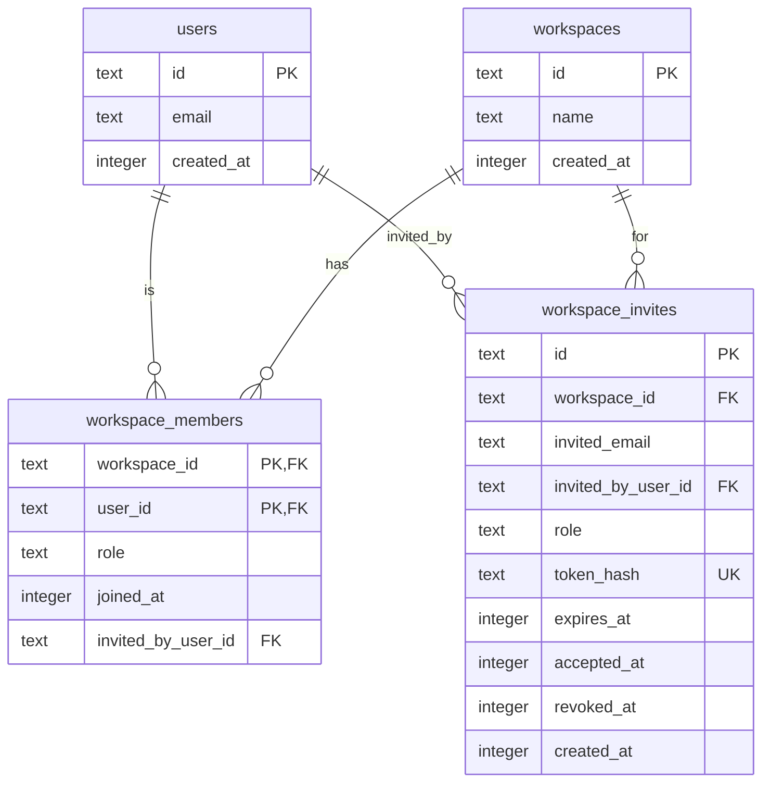
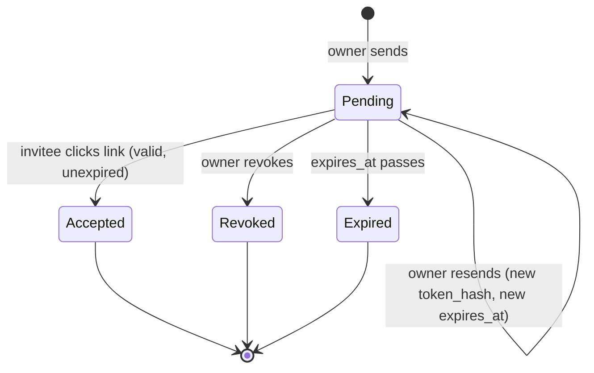
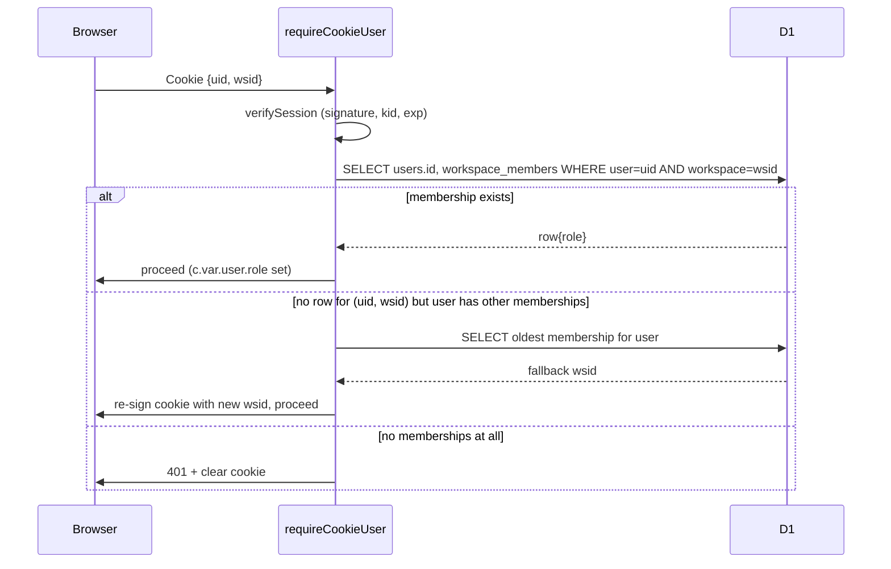

# feat: Workspace members and invites

## Overview

Move RavenScope from single-seat workspaces (`workspaces.owner_user_id` + 1:1 user-to-workspace cookie identity) to multi-member workspaces with two roles (Owner, Member), email-invite onboarding via Resend, multi-workspace membership per user, and a workspace switcher in the UI. No changes to the telemetry ingest path or API-key lifecycle.

---

## Problem Frame

RavenScope is used by FRC teams, but today only one email can sign in to see a team's sessions. Drive coach, programming mentor, and student lead all share one login or go without. The brainstorm (`docs/brainstorms/2026-04-23-001-feat-workspace-members-requirements.md`) established that teams want per-person identity with minimum-viable viewer scope: sessions + downloads only, nothing else. This plan captures the smallest cut that gets there without re-architecting ingest or inventing new permission primitives.

---

## Requirements Trace

- R1. Owner can invite a teammate by email; invitee receives a 7-day magic-link-style accept URL via Resend and becomes a Member on click (see origin: `docs/brainstorms/2026-04-23-001-feat-workspace-members-requirements.md`).
- R2. Member can sign in under their own email and see the shared workspace's sessions list + download `.wpilog`. Member cannot see API keys, quota, or audit log.
- R3. A single email can be Owner of one workspace and Member of others simultaneously; user picks the active workspace via an in-app switcher.
- R4. Owner can remove a member or revoke a pending invite and the effect is immediate on the removed party's next request.
- R5. A sole Owner cannot leave their workspace — only ownership transfer or explicit workspace deletion.
- R6. Every invite, revoke, accept, remove, leave, transfer, and workspace delete is recorded in `audit_log` with actor + workspace. Concretely: `workspace.member_invited`, `workspace.invite_revoked`, `workspace.invite_accepted`, `workspace.member_removed`, `workspace.member_left`, `workspace.ownership_transferred`, `workspace.deleted`. (`workspace.switched` is also added for forensics but is not an R6 event.)
- R7. Existing single-seat users see no behavioral change until they invite someone; telemetry ingest + session list + downloads are unmodified.

---

## Scope Boundaries

- Per-session or per-time-range ACLs — deferred.
- An Admin tier between Owner and Member — deferred.
- Cross-workspace session sharing (Google-Docs style) — out of scope.
- SSO or domain-based auto-join — out of scope.
- Email change or account merge — out of scope.
- Per-user invite/notification preferences beyond the invite email itself — out of scope. (The per-invited-email rate limit in U4 is operational gating, not a user preference, and is in scope.)

---

## Context & Research

### Relevant Code and Patterns

- **Session cookie + verification:** `packages/worker/src/auth/cookie.ts` (`SessionPayload = {uid, wsid, kid, exp}`, `loadKeySet`, `signSession`, `verifySession`). The cookie already carries `wsid`; we just gain a membership check.
- **Request-time auth:** `packages/worker/src/auth/require-cookie-user.ts` — hydrates `c.var.user` with `{userId, workspaceId, email, workspaceName}`. This is the central chokepoint for the new authz rules.
- **User identity union:** `packages/worker/src/auth/user.ts` (`CookieUser`, `ApiKeyUser`). `CookieUser` gains a `role` field.
- **Magic-link verify:** `packages/worker/src/auth/magic-link.ts` reads `workspaces.ownerUserId` to find a returning user's workspace. This is the only external dependency on the doomed column.
- **Token pattern to mirror:** `loginTokens` table + `generateToken` / `recordTokenRequest` / `verifyToken` pair — same raw-nonce → SHA-256 hash storage, same TTL gate, same `usedAt` replay guard.
- **Email template pattern:** `packages/worker/src/auth/email.ts` — `sendMagicLink` and `sendOperatorAlert` are both text-only Resend calls with the same retry + backoff structure. `sendInviteEmail` follows the same shape.
- **Audit catalog:** `packages/worker/src/audit/log.ts` — `AuditEventType` is a discriminated string union; extending it is a one-line change plus new call sites.
- **Rate limiting:** `packages/worker/src/routes/auth.ts` uses `checkRateLimit(env, {key, limit, windowSeconds})` twice for per-IP + per-email. Same helper applies to invite sends.
- **Hono route mounting:** `packages/worker/src/index.ts` wires `/api/auth`, `/api/keys`, `/api/sessions`, `/api/telemetry`. New `/api/workspaces` router mounts here.
- **Frontend shell:** `packages/web/src/components/TopNav.tsx` already renders `workspaceName` — becomes the workspace switcher location. `packages/web/src/app.tsx` declares routes under `AuthGate`.
- **Frontend auth state:** `packages/web/src/lib/auth.ts` (`useMe`) and `packages/web/src/lib/api.ts` (`fetchMe`, `UserMeResponse`). Response shape extension is the Web-side entry point for multi-workspace awareness.

### Institutional Learnings

- `docs/solutions/` does not exist yet in this repo; no prior learnings to import.
- The greenfield plan (`docs/plans/2026-04-17-001-feat-ravenscope-greenfield-plan.md`) established the `onDelete: "restrict"` discipline for all workspace/user FKs — preserve it.

### External References

- None required. All patterns are repo-local (Hono, Drizzle, D1 migrations, Resend, Radix UI).

---

## Key Technical Decisions

- **Drop `workspaces.owner_user_id`; make `workspace_members.role='owner'` the sole source of truth.** Keeping both would create a dual-write hazard every time ownership transfers. `magic-link.ts` is the only reader of the old column, and that code is being rewritten in this plan anyway. Rationale: unambiguous ownership semantics beat a small migration saving.
- **New `workspace_invites` table rather than reusing `login_tokens`.** Login tokens carry only `(email, token_hash, expiry, used_at)`; invites need `workspace_id`, `invited_by_user_id`, `role`, and `revoked_at`. Conflating them would bloat the login path and fight the 15-minute TTL.
- **Session cookie shape is unchanged.** `wsid` already exists; we just add a membership check on every authenticated request. Avoids cookie-schema churn, key rotation complications, and version detection logic.
- **Active-workspace switch is an explicit API call, not a per-request header.** `POST /api/auth/switch-workspace` verifies membership and re-signs the cookie with the new `wsid`. Keeps all existing workspace-scoped routes trivially correct — they continue to read `user.workspaceId` from the hydrated session.
- **Default workspace selection on sign-in is deterministic:** oldest membership by `joined_at` (then by `workspace_id` as tie-breaker). Avoids a new preferences table for v1; the switcher is always one click away.
- **Invite accept URL uses a distinct route (`/api/invites/accept`) rather than piggybacking `/api/auth/verify`.** Different TTL (7 days vs 15 minutes), different token table, different audit event. Sharing the endpoint would entangle two unrelated flows.
- **Removed members lose access on their *next* request, not pre-emptively.** We do not track active sessions. `requireCookieUser`'s membership check is the enforcement point; if the cookie's `wsid` is no longer a membership, we fall back to any remaining membership or force a re-login.
- **No email change to existing magic-link template.** The sign-in email is unchanged; a new invite email (`sendInviteEmail`) sits alongside it.
- **All three cookie re-sign paths preserve the original `exp`.** The existing key-rotation path in `require-cookie-user.ts` already does this; the fallback (U3), explicit switch (U3), and invite-accept (U4) all follow the same rule. Deepening the user's session by re-signing is not a product goal — only the signing key, the `wsid`, or both change. This avoids a removed member accidentally extending their session by triggering the fallback.
- **`workspace_members` uses `onDelete: "cascade"` — a deliberate exception to the repo's `onDelete: "restrict"` discipline.** Membership rows are pure join-table entries with no independent existence; cascading from both parents keeps removal flows simple and prevents orphaned memberships after a workspace or user delete. The restriction discipline is preserved elsewhere (`api_keys`, `telemetry_sessions`) because those rows carry business data.
- **`invite_email:<to>` rate-limit bucket is intentionally global across workspaces for a given destination email.** This caps aggregate invite volume to a single address at 3/hour regardless of how many workspaces send to it. Keying by `(workspace, email)` would leave a cross-workspace harassment vector. Do not change the key format without understanding this trade-off.
- **Cookie-fallback in `requireCookieUser` only executes on safe methods (`GET`, `HEAD`).** For state-mutating methods (`POST`, `PATCH`, `DELETE`, etc.), a stale cookie returns `401` with `Set-Cookie` clearing the stale cookie. Silently re-signing and continuing a mutating request against a different workspace is exactly the blast-radius expansion the brainstorm's tight Member scope exists to prevent.

---

## Open Questions

### Resolved During Planning

- *Session cookie shape:* no format change — reinterpret `wsid` as active workspace, add membership check.
- *Invite token storage:* new `workspace_invites` table.
- *Workspace switcher UX:* dropdown in `TopNav` (existing surface, no route addition needed for switching).
- *Rate limiting:* reuse `checkRateLimit` with keys `invite_ws:<wsid>` (20/day) and `invite_email:<to>` (3/hour, intentionally global across workspaces — see Key Technical Decisions).
- *Backfill:* migration inserts `workspace_members` rows from `workspaces.owner_user_id` before dropping the column.
- *`owner_user_id` retention:* dropped in the same migration.
- *Cookie `exp` on re-sign:* preserve the original `exp` in all three re-sign paths (fallback, explicit switch, invite-accept).
- *Fallback scope:* cookie-fallback in `requireCookieUser` is only applied to safe HTTP methods. Mutating requests with a stale cookie get `401` + cookie clear.
- *Accept-while-signed-in:* if the invitee's email differs from the signed-in user's email, return `409 {error: "email_mismatch"}` rather than silently swapping identities. If the signed-in user is already a member of the invited workspace, return `409 {error: "already_member"}`.
- *Partial unique index strategy:* hand-edit the generated migration to add the `WHERE accepted_at IS NULL AND revoked_at IS NULL` clause. `schema.ts` will intentionally drift from the migration SQL — document the deviation in a schema comment above the `workspaceInvites` table so future `drizzle-kit generate` runs don't strip the clause silently.

### Deferred to Implementation

- `drizzle-kit generate` emits the canonical table-rebuild for the `DROP COLUMN` on `workspaces`, but it will **not** emit the `INSERT INTO workspace_members SELECT ... FROM workspaces` backfill step. Implementer must hand-edit the generated migration to (1) create `workspace_members` and `workspace_invites`, (2) run the backfill INSERT, (3) perform the `workspaces` table-rebuild that drops `owner_user_id`. Visually verify the backfill sits between the CREATE statements and any statement that drops the source column.
- Copy for the invite email (subject line, body). Follow the magic-link template's tone; wording is low-risk and easy to iterate post-ship.
- Whether "Delete workspace" confirmation requires typing the workspace name (destructive-action pattern). Recommend yes; defer final UX to implementation.
- Whether `RateLimitDO` supports 86,400-second (one-day) windows cleanly, or whether the per-workspace invite cap should be reshaped as `20 / 4h` with one-shot reset. Verify during U4 implementation; the rate-limit DO is internal and cheap to extend if needed.

---

## High-Level Technical Design

> *These illustrate the intended approach and are directional guidance for review, not implementation specification. The implementing agent should treat them as context, not code to reproduce.*

### Post-migration data model (changed tables only)

Note: `workspaces.owner_user_id` is dropped. `workspace_members` has a composite PK `(workspace_id, user_id)`; role is `'owner' | 'member'` enforced in application code. `workspace_invites.token_hash` is unique; `accepted_at` and `revoked_at` are mutually exclusive (checked in app code, not DB).

### Invite lifecycle

### Authz flow for a cookie-authed request

---

## Implementation Units

- [ ] U1. **Schema: workspace_members, workspace_invites, drop owner_user_id**

**Goal:** New Drizzle tables + a D1 migration that creates them, backfills owner rows, and drops `workspaces.owner_user_id`.

**Requirements:** R1, R3, R5

**Dependencies:** None

**Files:**
- Modify: `packages/worker/src/db/schema.ts` (add `workspaceMembers`, `workspaceInvites`; remove `ownerUserId` from `workspaces`; add both to the `schema` export)
- Create: `packages/worker/migrations/0002_workspace_members.sql` (generated via `drizzle-kit generate`; hand-edit the table-rebuild step if needed)
- Modify: `packages/worker/migrations/meta/_journal.json` (generator-managed)

**Approach:**
- `workspaceMembers`: composite PK `(workspace_id, user_id)`; FKs to both parents with `onDelete: "cascade"` — deliberate exception to the repo's `onDelete: "restrict"` discipline (membership rows are pure join-table entries with no independent existence; see Key Technical Decisions for the full rationale); `role` is `TEXT` with values `'owner' | 'member'`; `invited_by_user_id` nullable FK to `users.id` with `onDelete: "set null"` (the invite chain shouldn't block deleting the inviter).
- `workspaceInvites`: UUID PK; FKs to `workspaces.id` (cascade) and `users.id` as `invited_by_user_id` (set null); `token_hash` uniquely indexed; `expires_at` is epoch-ms like existing tables; `accepted_at` and `revoked_at` both nullable; partial unique index on `(workspace_id, invited_email)` **where `accepted_at IS NULL AND revoked_at IS NULL`** to prevent duplicate pending invites.
- `schema.ts` will model `workspaceInvites` with a plain non-partial unique index (drizzle-orm does not express partial SQLite indexes in v0.45). The generated migration is hand-edited to add the `WHERE` clause. Add a comment above the `workspaceInvites` table in `schema.ts` noting the intentional drift so future `drizzle-kit generate` runs are reviewed by hand.
- Hand-authored migration ordering (the generator will emit only the CREATE + table-rebuild; the backfill INSERT is added manually):
  1. `CREATE TABLE workspace_members` (+ composite PK, FKs, indexes).
  2. `INSERT INTO workspace_members (workspace_id, user_id, role, joined_at, invited_by_user_id) SELECT id, owner_user_id, 'owner', created_at, NULL FROM workspaces;` — this step must appear **before** any statement that drops `owner_user_id`.
  3. `CREATE TABLE workspace_invites` with the non-partial unique index as generated, then `CREATE UNIQUE INDEX workspace_invites_pending_unique ON workspace_invites (workspace_id, invited_email) WHERE accepted_at IS NULL AND revoked_at IS NULL;` added by hand.
  4. SQLite table-rebuild that drops `workspaces.owner_user_id` (temp table + `INSERT SELECT` + `DROP` + `RENAME`, with `PRAGMA foreign_keys=OFF/ON` bookends as drizzle-kit emits).
- After this unit, `workspaces` has no column referencing `users`; all ownership flows through `workspace_members`.
- `joined_at` for backfilled rows equals `workspaces.created_at`. The U3 middleware query must use `ORDER BY joined_at ASC, workspace_id ASC` to ensure a deterministic fallback pick when two memberships share a millisecond (plausible for backfill collisions).

**Patterns to follow:**
- Existing `sqliteTable` + `index` + `uniqueIndex` + FK syntax in `packages/worker/src/db/schema.ts`.
- Timestamp columns: `integer(..., { mode: "timestamp_ms" }).$defaultFn(() => new Date())`.
- ID generation: `text("id").primaryKey().$defaultFn(() => crypto.randomUUID())`.

**Test scenarios:**
- Happy path: applying `0002_workspace_members.sql` to a DB containing two workspaces (each with an owner) produces two `workspace_members` rows with `role='owner'` and `joined_at` equal to the original `workspaces.created_at`.
- Happy path: after migration, `SELECT * FROM workspaces` no longer returns an `owner_user_id` column.
- Edge case: inserting a `workspace_members` row with a duplicate `(workspace_id, user_id)` fails on the composite PK.
- Edge case: inserting a `workspace_invites` row for `(workspace_id, email)` with an existing pending invite fails on the partial unique index; inserting succeeds once the pending row is marked `accepted_at` or `revoked_at`.
- Error path: attempting to delete a `users` row that has `workspace_members` rows succeeds only because of `onDelete: cascade` on the membership — verify cascade fires and orphans do not remain.
- Integration: run the full migration chain `0000 → 0001 → 0002` against a fresh DB and confirm `drizzle-kit`'s schema-introspection output matches the updated `schema.ts`.

**Files to test:** `packages/worker/src/db/schema.test.ts` (create; mirror the style of other worker tests using `@cloudflare/vitest-pool-workers`).

**Verification:** `pnpm -F @ravenscope/worker db:apply:local` completes cleanly against a primed DB; `SELECT role, COUNT(*) FROM workspace_members GROUP BY role` returns one row with `role='owner'` and count equal to pre-migration `workspaces` count.

---

- [ ] U2. **Audit catalog: member/invite/workspace event types**

**Goal:** Extend the `AuditEventType` union to cover every membership-related event emitted by U3–U6.

**Requirements:** R6

**Dependencies:** None (independent of U1; can land first if convenient)

**Files:**
- Modify: `packages/worker/src/audit/log.ts`

**Approach:** Add to the union, in this order (grouped by lifecycle):
- `workspace.member_invited`
- `workspace.invite_revoked`
- `workspace.invite_accepted`
- `workspace.member_removed`
- `workspace.member_left`
- `workspace.ownership_transferred`
- `workspace.deleted`
- `workspace.switched` — covers BOTH explicit user-initiated switch (via `POST /api/auth/switch-workspace`) and automatic cookie-fallback rewrites (when a cookie's `wsid` is no longer a valid membership). Distinguished by `metadata.reason`: `'explicit'` or `'cookie_fallback'`. For fallback events, also include `metadata.previous_wsid` and `metadata.new_wsid`. For forensics, the audit row's `workspace_id` column stores the **new** (target) workspace id for both reasons.

No new call sites in this unit — just the type extension. Call sites land with U3–U6.

**Patterns to follow:** Existing `AuditEventType` discriminated union.

**Test scenarios:** Test expectation: none — pure type extension, behavior verified by downstream unit tests.

**Verification:** `pnpm typecheck` succeeds; downstream units can import the new event types.

---

- [ ] U3. **Auth: membership-aware middleware, magic-link refactor, workspace switching**

**Goal:** Make every authenticated request aware of membership and role; rewrite magic-link verify to use `workspace_members` instead of `workspaces.owner_user_id`; add a workspace-switch endpoint and extend `/api/me`.

**Requirements:** R2, R3, R4, R7

**Dependencies:** U1, U2

**Files:**
- Modify: `packages/worker/src/auth/user.ts` (add `role: 'owner' | 'member'` to `CookieUser`)
- Modify: `packages/worker/src/auth/require-cookie-user.ts` (membership check + fallback)
- Create: `packages/worker/src/auth/require-owner-role.ts` (thin wrapper that 403s if `c.var.user.role !== 'owner'`)
- Modify: `packages/worker/src/auth/magic-link.ts` (`verifyToken`: insert `workspace_members` on first sign-in; on returning sign-in select the user's oldest membership instead of reading `owner_user_id`)
- Modify: `packages/worker/src/routes/auth.ts` (add `POST /switch-workspace`; extend `GET /me` to include `workspaces` list and `role`)
- Modify: `packages/worker/src/dto.ts` (extend `UserMeResponse`; add `SwitchWorkspaceRequest`)
- Modify: `packages/worker/src/auth/require-cookie-user.test.ts` (create if absent) and `packages/worker/src/routes/auth.test.ts`

**Approach:**
- `CookieUser` gains `role`. Role values are stored and transmitted as lowercase strings: `'owner' | 'member'`.
- `requireCookieUser` after verifying the signed cookie now joins `workspace_members` on `(wsid, uid)`. Three outcomes:
  1. **Membership found** → hydrate `c.var.user` with role and continue.
  2. **No membership for `wsid`, but user has at least one other membership.** Gate the fallback on HTTP method:
     - Safe methods (`GET`, `HEAD`): pick the fallback workspace via `SELECT ... FROM workspace_members WHERE user_id = ? ORDER BY joined_at ASC, workspace_id ASC LIMIT 1`, re-sign the cookie with the new `wsid` (preserving the original `exp` — never extend the session on fallback), hydrate `c.var.user` with the fallback workspace, continue. Log a `workspace.switched` audit row with `workspace_id` = new wsid, metadata `{reason: 'cookie_fallback', previous_wsid, new_wsid}`.
     - Mutating methods (`POST`, `PATCH`, `PUT`, `DELETE`): do **not** re-sign or continue. Clear the cookie and return `401 {error: "unauthenticated"}`. This prevents a write from executing against a workspace the client did not intend to target. The client's next navigation (a GET) will land cleanly via the fallback, or onto `/sign-in` if no memberships remain.
  3. **User has zero memberships** → clear cookie, return 401.
- Concurrent-request note: a removed member's browser typically fires several parallel reads (`/api/me`, `/api/sessions`). Each GET independently hits the fallback path; the `ORDER BY joined_at ASC, workspace_id ASC LIMIT 1` guarantees they all pick the same target, so the resulting cookie is consistent regardless of which `Set-Cookie` the browser keeps. N parallel fallbacks emit N `workspace.switched` audit rows — accepted as a known forensics quirk; dedupe belongs in a future log-processing pass, not the middleware.
- `requireOwnerRole` is a tiny middleware: assumes `requireCookieUser` already ran; checks `c.var.user.role === 'owner'` or returns `403 {error: "forbidden"}`.
- **Handler invariant:** every route handler reads `c.var.user.workspaceId` — never re-parses the incoming `Cookie` header — so a fallback that overwrote the effective identity for this request is reflected consistently in the handler's work and the response.
- `magic-link.ts verifyToken`:
  - First sign-in branch: create `users` row, create a default workspace, insert `workspace_members (workspaceId, userId, role='owner', joinedAt=now, invitedBy=null)` — all in a single `db.batch()` so a crash mid-insert leaves no partial rows (same pattern as today). Return the new `workspaceId`.
  - Returning sign-in branch: look up user by email, pick oldest membership using the same deterministic `ORDER BY joined_at ASC, workspace_id ASC`, return that `workspaceId`. If user has zero memberships (should be impossible post-backfill but defensive), create a fresh default workspace + owner membership and return it.
- `POST /api/auth/switch-workspace` (body: `{workspaceId}`): verifies membership, re-signs the cookie with new `wsid` **preserving the original `exp`**, logs `workspace.switched` with `metadata.reason='explicit'`, returns 204.
- `GET /api/me` extends to `{userId, email, activeWorkspace: {id, name, role}, workspaces: [{id, name, role}]}`, sorted by `joinedAt` ascending.

**Execution note:** Start with a failing integration test for the `requireCookieUser` fallback behavior. This is the load-bearing change; a wrong fallback silently drops users out of workspaces or loops them in the wrong one.

**Patterns to follow:**
- Hono middleware pattern in `packages/worker/src/auth/require-cookie-user.ts`.
- Dynamic `await import(...)` for DB modules (existing file does this).
- Re-sign cookie pattern when `reSignNeeded` is true (lines 66–79 of `require-cookie-user.ts`).

**Test scenarios:**
- *requireCookieUser:*
  - Happy path: cookie's `wsid` matches a membership → `c.var.user.role` reflects that row.
  - Happy path: member role on a workspace where the cookie says member → `role='member'`.
  - Edge case: user owns two workspaces; cookie points at the second; fallback is not triggered.
  - Error path (safe-method fallback): user was removed from the cookie's workspace but still owns another → `GET` request fallback re-signs cookie with owned workspace; response `Set-Cookie` header is present; `c.var.user.workspaceId` matches the new target; next request sees the new `wsid`; audit row has `workspace_id` = new wsid and `metadata.reason='cookie_fallback'`.
  - Error path (mutating-method rejection): same setup, but `POST /api/keys` is the incoming request → middleware returns 401 + cookie clear; no re-sign; no fallback; no audit `workspace.switched` row.
  - Error path: user has zero memberships → 401 + cookie cleared.
  - Error path: expired cookie → 401 (existing behavior preserved).
  - Concurrent-request integration: fire three parallel `GET` requests with the same stale cookie; assert all three receive the same fallback `wsid` in `Set-Cookie` (deterministic order), and that three `workspace.switched` audit rows are written (acknowledged behavior).
  - Re-sign preserves `exp`: given a cookie with `exp = now + 5m`, the post-fallback cookie also has `exp = now + 5m` (within tolerance) — never extended to full TTL by the fallback path.
- *requireOwnerRole:* owner passes through; member gets 403 with `{error: "forbidden"}`.
- *magic-link verifyToken:*
  - Happy path: new email → user + workspace + owner membership created atomically.
  - Happy path: returning user with one owned workspace → resolves to that workspace.
  - Happy path: returning user who owns workspace A and is a member of B (B joined first) → resolves to B (oldest membership wins).
  - Edge case: returning user with zero memberships (defensive path) → new workspace + owner membership created.
- *POST /switch-workspace:*
  - Covers F3 / AE-switch. Happy path: owner of workspace A, member of workspace B, currently active on A → POST with B's id re-signs cookie, returns 204, subsequent `GET /api/me` reports B as active.
  - Error path: POST with a workspace the user is not a member of → 403.
  - Error path: POST with unknown workspace id → 404.
- *GET /me:*
  - Happy path: response includes the user's workspace list sorted by `joinedAt` with per-entry role; `activeWorkspace` matches the cookie's current `wsid`.
  - Edge case: user belongs to exactly one workspace → `workspaces` is a one-element array.

**Verification:** Web client sees `workspaces[]` in `/api/me` and can drive a switch end-to-end; removed-member test flow lands them in their own workspace without an explicit re-sign-in.

---

- [ ] U4. **Invite API: send, list, revoke, resend, accept + Resend email**

**Goal:** Owner-only invite management endpoints + the public `/api/invites/accept` route + a new invite email template.

**Requirements:** R1, R4, R6

**Dependencies:** U1, U2, U3

**Files:**
- Create: `packages/worker/src/routes/invites.ts` (owner-scoped: POST / GET / DELETE / resend under `/api/workspaces/:wsid/invites`; public: `POST /api/invites/accept`)
- Create: `packages/worker/src/auth/invite-token.ts` (token generation + hash, mirroring `magic-link.ts`'s `generateToken` / `sha256Base64Url`)
- Modify: `packages/worker/src/auth/email.ts` (add `sendInviteEmail(config, to, {workspaceName, inviterEmail, acceptLink})`; same retry pattern as `sendMagicLink`)
- Modify: `packages/worker/src/index.ts` (mount new routes)
- Modify: `packages/worker/src/dto.ts` (add `InviteCreateRequest`, `InviteDto`, `PendingInvitesResponse`, `AcceptInviteResponse`)
- Create: `packages/worker/src/routes/invites.test.ts`
- Modify: `packages/worker/src/auth/email.test.ts` (create if absent; test `sendInviteEmail` retry + success)

**Approach:**
- `POST /api/workspaces/:wsid/invites` (owner-only): validates email, checks per-workspace rate limit (`invite_ws:<wsid>` 20/day) and per-email rate limit (`invite_email:<to>` 3/hour, intentionally global across workspaces), rejects if an active pending invite already exists for `(wsid, email)`, rejects if the email is already a member, generates a token, inserts `workspace_invites` with 7-day TTL, sends Resend email with `${origin}/accept-invite?token=${nonce}`, logs `workspace.member_invited`.
- **Insert-then-send with compensating delete (NOT a DB transaction spanning the HTTP call — Workers/D1 do not support that).** Ordering: (1) INSERT the `workspace_invites` row. (2) Call `sendInviteEmail`. (3) On Resend 4xx (non-retriable — bad API key, bad recipient), `DELETE FROM workspace_invites WHERE id = ?` and return `500` to the caller so they can retry cleanly. (4) On 5xx after retries, keep the row, audit `workspace.member_invited` with `metadata.email_send_failed=true`, and return `202` so the owner can use `POST /resend` later. This is a compensating-action pattern, not a transaction.
- `GET /api/workspaces/:wsid/invites` (owner-only): returns pending invites only (`accepted_at IS NULL AND revoked_at IS NULL AND expires_at > now`), newest first.
- `DELETE /api/workspaces/:wsid/invites/:id` (owner-only): sets `revoked_at = now`. Idempotent (already-revoked is a 204). Logs `workspace.invite_revoked`.
- `POST /api/workspaces/:wsid/invites/:id/resend` (owner-only): generates a new token, updates the row's `token_hash` and `expires_at` (now + 7 days), re-sends email, logs `workspace.member_invited` with metadata `{resend: true}`. Same insert-then-send compensating pattern — on 4xx Resend failure, revert the token/expiry update.
- `POST /api/invites/accept` (public): body `{token}`. Hash → lookup `workspace_invites`. Reject (410) if revoked, accepted, expired, or unknown.
  - **Email-match check** (signed-in case): if the request carries a valid signed cookie whose `userId` resolves to an email different from `invite.invited_email`, return `409 {error: "email_mismatch"}`. Do not silently swap identities.
  - **Already-member check**: if `workspace_members` already contains a row for `(invite.workspace_id, resolved_user_id)`, mark the invite `accepted_at` (to prevent reuse), return `409 {error: "already_member"}`.
  - **Happy path**: resolve invited email to user (create user if needed). Insert `workspace_members` with `role='member'`. Mark invite `accepted_at`. Sign a session cookie with the invited `wsid`, preserving any existing `exp` if the user was already signed in (fresh cookie gets full TTL if they weren't). Log `workspace.invite_accepted` with `ipHash` set (so accept origin is forensically traceable).
  - **Constant-work discipline** (email-enumeration guard): always run the user-lookup query before branching on `create-vs-proceed`, mirroring `magic-link.ts`'s approach. Response timing for new-user vs. returning-user paths should be indistinguishable within normal noise.
  - **Response**: server-side `302 Location: /` (with `Set-Cookie` on the response) rather than `200 {json}` + client redirect. This removes the token from the browser URL bar immediately and prevents it from sitting in the address bar during any success splash. The `/accept-invite` Web page (U8) handles failure cases client-side after the 302 fails; success is invisible to the SPA.
- `/accept-invite` response headers include `Referrer-Policy: no-referrer` and `Cache-Control: no-store` to prevent token leakage via Referer header or cached intermediate proxies.
- `sendInviteEmail` subject: `"<inviterEmail> invited you to <workspaceName> on RavenScope"`. Body text mirrors the magic-link email tone (short, no marketing, explicit expiry note, and an explicit "If you didn't expect this invite, you can safely ignore this email" line).

**Patterns to follow:**
- Rate-limit structure in `packages/worker/src/routes/auth.ts` lines 34–41.
- Token-generate + hash pattern in `packages/worker/src/auth/magic-link.ts` (`generateToken`, `sha256Base64Url`).
- Resend retry + backoff loop in `packages/worker/src/auth/email.ts`.
- Audit logging pattern via `logAudit(db, {eventType, actorUserId, workspaceId, ipHash, metadata})`.

**Test scenarios:**
- *POST create invite:*
  - Covers AE-invite-send. Happy path: owner invites `coach@team1310.ca` → 201, `workspace_invites` row exists, Resend called with the accept link, audit row logged.
  - Edge case: invite to an email that is already a `workspace_members` row → 409 `{error: "already_member"}`.
  - Edge case: second invite to the same pending email → 409 `{error: "invite_pending"}`.
  - Edge case: invite to a malformed email → 400.
  - Error path: member (non-owner) tries to invite → 403 (from `requireOwnerRole`).
  - Error path: 21st invite from the same workspace within 24h → 429 with `Retry-After`.
  - Error path: Resend returns 401 (bad API key) → 500 to the owner; the INSERT happened, but the compensating DELETE fires before the handler returns. Assert final DB state has no `workspace_invites` row for this email.
  - Error path: Resend returns 503 three times → 202 to the owner, invite row remains with `expires_at` set, audit metadata `{email_send_failed: true}`. Owner can `POST /resend` to retry.
- *GET list pending:*
  - Happy path: returns only rows with null `accepted_at`, null `revoked_at`, `expires_at > now`.
  - Happy path: ordered by `created_at DESC`.
- *DELETE revoke:*
  - Happy path: pending invite → 204, row has `revoked_at` set, audit logged. Subsequent accept of that token → 410.
  - Edge case: already-revoked invite → 204 (idempotent).
  - Error path: revoke on an accepted invite → 409 `{error: "already_accepted"}`.
- *POST resend:*
  - Happy path: pending invite → new `token_hash`, new `expires_at`, Resend called, audit `metadata={resend: true}`.
  - Error path: resend on revoked/accepted invite → 409.
- *POST accept:*
  - Covers AE-invite-accept. Happy path (new user): token valid → user created, membership created, cookie signed, response is `302` to `/`. Subsequent `/api/me` shows the workspace as active.
  - Happy path (returning user): token valid → membership appended, active workspace switched to invited one, response is `302` to `/`, `/api/me` reflects the invited workspace.
  - Error path: expired token → 410.
  - Error path: revoked token → 410.
  - Error path: already-accepted token → 410.
  - Error path: malformed token → 400.
  - Error path: signed-in as `alice@x.com` and invited email is `bob@x.com` → 409 `{error: "email_mismatch"}`; no cookie change; original session preserved; no `workspace_members` row created.
  - Error path: signed-in user is already a member of the invited workspace → 409 `{error: "already_member"}`; invite is marked `accepted_at` to prevent reuse; no duplicate `workspace_members` row.
  - Timing parity: new-user and returning-user paths complete within the same 95th-percentile range (no early-exit before user-lookup query); explicit test asserts the DB query count is identical across the two paths.
  - Security: response headers include `Referrer-Policy: no-referrer` and `Cache-Control: no-store`.
- *sendInviteEmail:* mirrors `sendMagicLink` tests — 2xx success, 4xx no retry, 5xx retries 3× then fails.

**Verification:** End-to-end manual: owner sends an invite from the UI; invited address receives an email; clicking the accept link (in a new browser) signs the invitee in and drops them on the shared workspace's sessions list.

---

- [ ] U5. **Member-management API: list, remove, leave, transfer, delete-workspace**

**Goal:** Every member/ownership lifecycle mutation except invites, with the sole-owner safety rule enforced server-side.

**Requirements:** R4, R5, R6

**Dependencies:** U1, U2, U3

**Files:**
- Create: `packages/worker/src/routes/workspace-members.ts` (mounted under `/api/workspaces/:wsid/members` and `/api/workspaces/:wsid`)
- Modify: `packages/worker/src/index.ts` (mount the new routes)
- Modify: `packages/worker/src/dto.ts` (add `MemberDto`, `MembersResponse`, `TransferOwnershipRequest`)
- Create: `packages/worker/src/routes/workspace-members.test.ts`

**Approach:**
- `GET /api/workspaces/:wsid/members` (owner-only): returns `{userId, email, role, joinedAt, invitedByUserId}[]` sorted by `joinedAt ASC`. Joins `workspace_members` against `users` for email. Single query.
- `DELETE /api/workspaces/:wsid/members/:userId` (owner-only): refuses to remove self (owner uses `/leave` or `/transfer` instead) and refuses to remove the only remaining owner (impossible given only one owner, but defensive). Deletes the `workspace_members` row. Logs `workspace.member_removed`. Returns 204.
- `POST /api/workspaces/:wsid/leave` (any member): if the caller is the sole owner → 409 `{error: "sole_owner_cannot_leave", hint: "transfer_or_delete"}`. Otherwise delete the caller's `workspace_members` row; log `workspace.member_left`; return 204. The caller's next request triggers the fallback in `requireCookieUser`.
- `POST /api/workspaces/:wsid/transfer` (owner-only, body: `{newOwnerUserId}`): verifies the new owner is a current member and not self, then in a single `db.batch()` runs two **predicate-protected** UPDATEs so the check-then-act is self-protecting:
  - `UPDATE workspace_members SET role='member' WHERE workspace_id=? AND user_id=? AND role='owner'` (caller).
  - `UPDATE workspace_members SET role='owner' WHERE workspace_id=? AND user_id=? AND role='member'` (target).
  Check `meta.changes` on each batched statement afterwards: if either is 0, the state changed mid-request (the target was removed, or the caller was already demoted), roll back by re-running the inverse update and return `409 {error: "transfer_race"}`. Log `workspace.ownership_transferred` with `metadata={fromUserId, toUserId}`. Return 204.
- `DELETE /api/workspaces/:wsid` (owner-only). This spans D1 **and** R2 — orphaned R2 blobs would break the "all data removed" promise in the UI's danger-zone confirmation. Order:
  1. Enumerate all `telemetry_sessions.id` for this workspace.
  2. For each session id, list and delete the R2 objects under `batchPrefix(sessionId)` plus any `wpilogKey`. Mirrors the existing per-session cleanup in `packages/worker/src/routes/sessions.ts` (`DELETE /:id`) — extract a helper if this is the second caller.
  3. Delete D1 dependents in explicit order: `telemetry_sessions` (this cascades `session_batches` at the schema level — do not issue a separate delete for batches), `api_keys`, `workspace_members`, `workspace_invites`, `workspaces`.
  4. Emit `workspace.deleted` audit with `metadata={sessionCount, r2ObjectCount, apiKeyCount}`. Return 204.
  Because existing FKs on `telemetry_sessions` and `api_keys` use `onDelete: "restrict"`, the route must explicitly delete those dependents before the final `workspaces` delete — D1 will not cascade them for us.

**Execution note:** Use `db.batch()` for ownership transfer to avoid the "promoted then demoted itself" race. Transfer is the one place two roles change in one request.

**Patterns to follow:**
- `db.batch()` usage — already used in `magic-link.ts` for atomic user+workspace creation.
- Returning 204 for successful mutations (matches `/logout`, `/revoke-key`, etc.).

**Test scenarios:**
- *GET members:* Happy path: owner + three members → 4 rows in correct order with correct roles.
- *DELETE member:*
  - Happy path: owner removes member X → row deleted, audit logged. X's next authenticated request falls back per U3 to their own workspace or 401.
  - Error path: owner tries to remove self → 409 with hint pointing at `/leave` or `/transfer`.
  - Error path: member tries to remove anyone → 403.
  - Error path: target user is not a member → 404.
- *POST leave:*
  - Happy path: member leaves → 204, row deleted, audit logged.
  - Happy path: owner with another owner in workspace (impossible in v1, but the check is the sole-owner branch) leaves → 204.
  - Covers AE-sole-owner-block. Error path: sole owner leaves → 409 `{error: "sole_owner_cannot_leave"}`.
  - Integration: after leave, `requireCookieUser` fallback triggers on next request; no data leakage into the left workspace.
- *POST transfer:*
  - Happy path: owner transfers to member → both rows updated atomically, subsequent `/me` shows new roles.
  - Error path: new owner is not a current member → 409.
  - Error path: non-owner attempts transfer → 403.
  - Edge case: transfer to self → 400 `{error: "target_is_self"}`.
  - Race integration: fabricate the race by stubbing the batch to observe the target member being removed between the verify-member SELECT and the UPDATEs → second UPDATE's `meta.changes === 0` → handler rolls back the first UPDATE and returns 409; post-test DB has the caller still as owner and no phantom-member row.
- *DELETE workspace:*
  - Covers AE-workspace-delete. Happy path: workspace with sessions + API keys → D1 cascade completes, counts reported in audit metadata.
  - Happy path (R2 cleanup): seed R2 with batch blobs + wpilog for two sessions in the workspace → after DELETE, assert the R2 bucket contains no objects with keys prefixed by either session id; audit `metadata.r2ObjectCount` matches the number of deleted objects.
  - Error path: non-owner → 403.
  - Error path: R2 delete fails mid-operation → D1 rows are **not** deleted (R2 step runs first); returns 500; subsequent retry is safe because DELETE is idempotent.
  - Edge case: workspace with in-flight session (uploaded_count < entry_count) → same cascade; the user has been warned client-side.

**Verification:** `pnpm -F @ravenscope/worker test` passes all new cases; manual: deleting a workspace via UI removes it from `/api/me.workspaces` immediately for every other signed-in member.

---

- [ ] U6. **Role gating: hide owner-only routes from members**

**Goal:** Apply `requireOwnerRole` to every existing workspace-scoped endpoint that the brainstorm puts out of a member's view.

**Requirements:** R2

**Dependencies:** U3

**Files:**
- Modify: `packages/worker/src/routes/api-keys.ts` (add `requireOwnerRole` after `requireCookieUser`)
- Modify: `packages/worker/src/routes/sessions.ts` (apply `requireOwnerRole` to the existing `PATCH /:id` and `DELETE /:id` routes; leave GET list / GET detail / GET wpilog untouched)
- Confirm: `packages/worker/src/routes/telemetry.ts` is unaffected (bearer-auth path, no cookie user).
- Confirm: `packages/worker/src/routes/wpilog.ts` allows members (download path).

**Approach:**
- `api-keys.ts`: add middleware. All existing endpoints (list / create / revoke) become owner-only.
- `sessions.ts`: keep GET list, GET detail, and GET wpilog unchanged — members need these per R2. Mutating endpoints become owner-only:
  - `PATCH /:id` (FMS event name edit): `requireOwnerRole`. Rationale: R2 scopes Member access to read + download only; editing session metadata is a write outside that scope.
  - `DELETE /:id` (session delete): `requireOwnerRole`. Same rationale.
- No quota/usage endpoint exists yet (`daily_quota` is internal). The caps plan (`docs/plans/2026-04-23-001-feat-daily-usage-caps-plan.md`) owns global quota enforcement; this plan does not add per-workspace quota visibility. If a future admin endpoint is added, that work will own role gating independently.
- Gate-checking is done *after* `requireCookieUser` so `c.var.user.role` is already populated.

**Patterns to follow:** Existing `sessionsRoutes.use("*", requireCookieUser)` middleware chain.

**Test scenarios:**
- *API keys as member:* GET /api/keys → 403; POST /api/keys → 403; DELETE /api/keys/:id → 403.
- *API keys as owner:* unchanged; all endpoints still work.
- *Sessions as member:* GET list → 200; GET detail → 200; GET wpilog → 200; PATCH /api/sessions/:id → 403; DELETE /api/sessions/:id → 403.
- *Sessions as owner:* PATCH /api/sessions/:id → 200 (unchanged); DELETE /api/sessions/:id → 204 (unchanged).
- Integration: switch a user's role from owner to member (via transfer) and confirm the 200-vs-403 flip on PATCH without a re-login.

**Verification:** `pnpm -F @ravenscope/worker test` green; existing tests for api-keys routes are updated to include both owner and member callers.

---

- [ ] U7. **Web: TopNav workspace switcher + conditional API Keys nav**

**Goal:** Let users switch workspaces from the shell; hide the API Keys nav tab when the active role is `member`.

**Requirements:** R2, R3

**Dependencies:** U3 (needs the extended `/api/me` shape and switch endpoint)

**Files:**
- Modify: `packages/web/src/lib/api.ts` (extend `UserMeResponse` to match U3; add `switchWorkspace(workspaceId)` helper)
- Modify: `packages/web/src/lib/auth.ts` (no shape change; consumers read the new fields directly)
- Modify: `packages/web/src/components/TopNav.tsx` (replace the static workspace pill with a Radix dropdown showing all `workspaces`; "Switch" action calls `switchWorkspace` then invalidates queries)
- Modify: `packages/web/src/components/TopNav.test.tsx` (create if absent)
- Modify: `packages/web/src/app.tsx` (no change unless we add route-level role guards)

**Approach:**
- Replace the `workspaceName` pill with a Radix `DropdownMenu` trigger. Menu body lists each workspace with a check-mark on the active one, labels role as a small badge (`Owner` / `Member`), and a separator + "Workspace settings" link.
- `switchWorkspace` mutates via `POST /api/auth/switch-workspace`, then triggers a hard page navigation via `window.location.assign("/")`. A hard reload (not just `queryClient.invalidateQueries()`) is deliberate: every in-memory route state (open modals, filters, form drafts) assumed the prior workspace. Refetching data while retaining route state is a footgun for a cross-tenancy switch. The test scenario asserts the hard navigation.
- Conditional nav: `me.data.activeWorkspace.role === 'owner'` gates the API Keys `NavTab`.
- Keep the avatar + sign-out affordance unchanged.

**Patterns to follow:**
- `@radix-ui/react-dropdown-menu` is not yet a dependency; the repo already has `@radix-ui/react-tooltip` (see `packages/web/src/app.tsx`). Add `@radix-ui/react-dropdown-menu` to `packages/web/package.json` (align on the same major version as other Radix packages).
- Tailwind + Swiss Clean tokens — follow `Tooltip.tsx` and `Button.tsx` for spacing + border + color tokens.

**Test scenarios:**
- Happy path (owner with 2 workspaces): dropdown renders both; clicking the inactive one calls `switchWorkspace`; on success a hard navigation to `/` fires (`window.location.assign` was called); after the navigation, TopNav reflects the new active workspace.
- Happy path (member): API Keys nav tab is absent; Sessions tab remains.
- Happy path (owner): API Keys nav tab is present.
- Edge case: single-workspace user → dropdown still renders but shows the one entry with a check mark; design intentionally does not hide the dropdown so the feature is discoverable.
- Error path: `switchWorkspace` returns 403 (membership revoked mid-session) → toast error, `useMe` refetch falls back to the new active workspace via the cookie rewrite (U3's fallback).

**Verification:** Manual: sign in as a user with two memberships, confirm the switcher swaps the sessions list under the TopNav, confirm API Keys tab appears/disappears with role.

---

- [ ] U8. **Web: Workspace settings page + accept-invite page**

**Goal:** The owner-facing surfaces (members list, pending invites, invite form, transfer, leave, delete) and the public invite-acceptance landing page.

**Requirements:** R1, R4, R5

**Dependencies:** U4, U5, U7

**Files:**
- Create: `packages/web/src/routes/workspace-settings.tsx`
- Create: `packages/web/src/routes/accept-invite.tsx`
- Modify: `packages/web/src/app.tsx` (register `/workspace/settings` under `AuthGate`; register `/accept-invite` as public)
- Modify: `packages/web/src/lib/api.ts` (add API helpers: `listMembers`, `removeMember`, `leaveWorkspace`, `transferOwnership`, `deleteWorkspace`, `listInvites`, `sendInvite`, `revokeInvite`, `resendInvite`, `acceptInvite`)
- Create: `packages/web/src/routes/workspace-settings.test.tsx`
- Create: `packages/web/src/routes/accept-invite.test.tsx`

**Approach:**
- `/workspace/settings` (owner-only; members see a 403 page or a redacted version that only shows "Leave workspace"):
  - Section 1: *Members* — table of `{email, role, joinedAt, actions}`. Owner can `Remove` any member (confirmation dialog) and `Make owner` (transfer; strong confirmation: "You will become a Member. Continue?"). Displays the current user's own row with a "Leave workspace" action (blocked + tooltip if sole owner).
  - Section 2: *Pending invites* — table of `{email, sentAt, expiresAt, actions}`. Actions: `Resend`, `Revoke`. Input at top: email + `Send invite`.
  - Section 3: *Danger zone* — `Delete workspace` button with a typed-name confirmation.
- `/accept-invite?token=...`:
  - The Web page is only shown on failure. On page load, the token is read from the query string and `POST /api/invites/accept` is called once; the server handler responds with a `302` to `/` on success (setting the session cookie), so the user never sees this page for a happy-path accept. The token disappears from the browser URL bar as soon as the server-side redirect is followed.
  - On failure (410 expired/revoked/unknown, 409 email_mismatch, 409 already_member), the page renders a clear error with a "Ask for a new invite" hint (and, for email_mismatch, a "Sign out and try again" link).
  - Served with `Referrer-Policy: no-referrer` and `Cache-Control: no-store` response headers. This also applies to the `POST /api/invites/accept` response.
- Both pages: use the existing Swiss Clean tokens; rely on Radix dialogs for confirmations (requires `@radix-ui/react-dialog` — add to deps if absent).
- `/workspace/settings` is the dropdown target from U7.

**Patterns to follow:**
- Route structure in `packages/web/src/routes/api-keys.tsx` for list + create + revoke pattern.
- Error-boundary wrapping in `packages/web/src/components/ErrorBoundary.tsx`.
- Form + mutation pattern in `SignIn.tsx` (email input + submit + server error display).

**Test scenarios:**
- *Settings — members:*
  - Happy path: owner sees all members with correct role badges.
  - Happy path: owner clicks Remove on member X → confirmation dialog → API call → member vanishes from the list (optimistic or post-invalidate).
  - Happy path: owner clicks `Make owner` on member X → confirmation dialog warns of demotion → success banner; UI now reflects X as owner and the original user as member; subsequent API calls that require owner role fail (they're no longer owner).
  - Error path: owner who is sole-owner sees `Leave workspace` disabled with a tooltip pointing at transfer or delete.
- *Settings — invites:*
  - Covers AE-invite-send (UI). Happy path: owner sends an invite → new row appears in pending list with sent-at and expires-at.
  - Happy path: click `Revoke` → row disappears.
  - Happy path: click `Resend` → expires-at updates; toast confirms email re-sent.
  - Error path: sending to an already-pending email → inline error.
- *Settings — danger zone:*
  - Happy path: owner types workspace name, clicks Delete → workspace removed, user redirected to their next workspace (or sign-in if none remain).
  - Error path: wrong name typed → Delete disabled.
- *Accept-invite page:*
  - Covers AE-invite-accept (UI). Happy path (new user): navigates to `/accept-invite?token=...`, server responds with 302 to `/`, the `/accept-invite` React component is not rendered because the page never lands on it; the final page is `/` with the invited workspace active.
  - Happy path (signed-in existing user): same as above; the 302 fires, the SPA lands on `/`, `/api/me` reflects the new active workspace.
  - Error path: expired token → 410 response → React component mounts and renders error copy with next-steps hint; no redirect; token parameter still in URL (acceptable because token is already invalidated).
  - Error path: email_mismatch → 409 response → error copy offers "Sign out and try a different account" affordance.

**Verification:** Manual end-to-end: two-browser flow — owner invites `coach@example.com`, the coach clicks the Resend email, lands in the workspace, sees sessions list, cannot see API Keys nav or `/workspace/settings` destructive controls.

---

## System-Wide Impact

- **Interaction graph:** Every cookie-authenticated route now depends on `workspace_members` being correct. `requireCookieUser` is the chokepoint — one query change touches `/api/me`, `/api/sessions/*`, `/api/keys/*`, logout, and every future cookie route.
- **Error propagation:** Membership failures propagate differently by HTTP method. Safe methods (`GET`, `HEAD`) trigger the cookie-fallback + in-band re-sign. Mutating methods (`POST`, `PATCH`, `PUT`, `DELETE`) return `401` with cookie clear — they never execute against an auto-switched workspace. The split prevents a removed-member's stale cookie from landing a write on a workspace they did not intend to target.
- **State lifecycle risks:** Ownership transfer mutates two rows via predicate-protected UPDATEs in a `db.batch()`, with post-batch `meta.changes` verification to catch concurrent-removal races. Workspace delete cascades five D1 tables *and* the workspace's R2 objects (batch blobs, tree caches, wpilog files); the route orchestrates deletes explicitly because the schema uses `onDelete: "restrict"` on `telemetry_sessions` and `api_keys`, and because R2 cleanup cannot be driven by a D1 cascade.
- **API surface parity:** `/api/me` response shape changes (new `workspaces[]` + `role` fields). The only consumer is our Web client; no external integrations. Field additions are backwards-compatible for `null`-tolerant callers.
- **Integration coverage:** Member-removal, sole-owner-leave, transfer-race, fallback-on-mutation, and workspace-delete-with-R2-cleanup are all cross-layer. Each needs an integration test spanning route → DB (→ R2 where applicable) → subsequent request, not just a unit test mocking the DB.
- **Unchanged invariants:** `/api/telemetry/*` bearer-auth path is untouched. API keys continue to be workspace-scoped and do not gain a user dimension. The signed-cookie format version (`v1`) is unchanged; `SESSION_SECRET` rotation semantics are preserved. The existing `GET /api/sessions`, `GET /api/sessions/:id`, and `GET /api/sessions/:id/wpilog` routes are unchanged — Members see the same data an Owner sees on those endpoints.

---

## Risks & Dependencies

| Risk | Mitigation |
|------|------------|
| `DROP COLUMN workspaces.owner_user_id` requires a SQLite table rebuild; a mistake can wedge D1 migrations permanently, and `drizzle-kit generate` will not emit the backfill INSERT. | Hand-edit the generated migration to insert the backfill `INSERT INTO workspace_members SELECT ...` between the `CREATE TABLE` statements and the `workspaces` table-rebuild. Apply against a primed local DB first (`pnpm db:apply:local`), diff the resulting schema, then apply remote. Before `db:apply:remote`, take a `wrangler d1 export` snapshot; rollback procedure is documented in Operational Notes. |
| drizzle-orm v0.45 cannot express partial SQLite unique indexes; `workspace_invites` needs one to prevent duplicate pending invites for `(workspace_id, email)`. | Model a non-partial unique in `schema.ts` and hand-edit the generated migration to add the `WHERE accepted_at IS NULL AND revoked_at IS NULL` clause. Add a schema comment flagging the intentional drift so future `drizzle-kit generate` runs are reviewed by hand. |
| `requireCookieUser` fallback could silently re-scope a removed member to a workspace they do not expect to be in, *especially* on a mutating request. | Restrict fallback to safe methods (`GET`, `HEAD`) only; mutating requests with a stale cookie return 401 + cookie-clear. Force `workspace.switched` audit on every fallback with `metadata.reason='cookie_fallback'` and `workspace_id` set to the new target. Use `ORDER BY joined_at ASC, workspace_id ASC LIMIT 1` so concurrent fallbacks converge deterministically. |
| Invite rate-limit buckets colliding with magic-link buckets (both go through `RateLimitDO`). | Use distinct key prefixes (`invite_ws:`, `invite_email:`). `invite_email:<to>` is intentionally global across workspaces to cap harassment volume to a single destination regardless of attacker workspace count. |
| Resend transient failure after `workspace_invites` row already inserted leaves a stranded pending invite, but Workers cannot hold a DB transaction across an `await fetch`. | Compensating-action pattern in the route handler: INSERT → call Resend → on 4xx, `DELETE` the row and return 500; on 5xx-after-retries, keep the row, audit `email_send_failed=true`, return 202. Test both compensating paths directly. |
| Transfer ownership check-then-act race: target member is removed between the verify-member SELECT and the role UPDATEs, leaving a workspace with zero owners. | Batch uses predicate-protected UPDATEs (`WHERE role='owner'` and `WHERE role='member'`) and post-batch `meta.changes` verification per statement. If either is 0, invert the first UPDATE and return 409 `transfer_race`. |
| Workspace delete orphans R2 objects (batch blobs, tree caches, wpilog files), breaking the "all data removed" UX promise. | U5's DELETE route enumerates sessions, cleans their R2 prefixes and any `wpilogKey` **before** cascading D1 rows — same ordering as the existing `sessions.ts DELETE /:id`. Extract a shared helper. Audit metadata includes `r2ObjectCount`. |
| 7-day invite tokens in URLs persist in browser history; referrer leakage on the accept page exposes the token to third parties. | Server-side `302 /` on accept success so the token disappears from the address bar immediately. `Referrer-Policy: no-referrer` and `Cache-Control: no-store` on both the accept page and the accept API response. Single-use enforcement (token can't be replayed post-accept) remains the primary backstop. |
| Signed-in user clicks an invite token intended for a different email; naive implementation would silently swap identities. | Accept endpoint compares signed-in email to `invite.invited_email` and returns 409 `email_mismatch` on divergence. Existing session and identity unchanged. |
| Accept endpoint leaks email existence via response-timing difference between new-user and returning-user code paths. | Mirror `magic-link.ts`'s constant-work discipline: always execute the user-lookup query before branching. Assert equal DB query count across both paths in tests. |
| Radix UI dependency additions (`dropdown-menu`, `dialog`) bloat the bundle. | Both are tree-shakeable and <10 KB gz each. Confirm bundle size delta via `wrangler deploy --dry-run` after the Web units. |
| An accepted invite creates a user-row for an email that never intended to sign up (e.g., invite sent to the wrong address). | Magic-link auth is already opt-in: the invitee must still click an emailed link. Pending invites are owner-revocable before click. Invite email body explicitly says "If you didn't expect this, ignore it." |

---

## Documentation / Operational Notes

- Update `README.md` to describe members + invites under a new "Workspaces" section.
- `docs/design/ravenscope-ui.pen` needs a new artboard for `/workspace/settings` + the TopNav dropdown. Flag to the design pass; UI code uses the existing token set so shipping before the artboard lands is acceptable.
- **Migration rollout checklist** (applies specifically to U1):
  1. `pnpm -F @ravenscope/worker db:apply:local` and run the full test suite.
  2. `wrangler d1 export <prod-db-name> --output=backups/pre-0002-$(date -u +%Y%m%d).sql` — captures a recoverable snapshot before any production schema change.
  3. `pnpm -F @ravenscope/worker db:apply:remote`.
  4. Verify: `wrangler d1 execute <prod-db-name> --remote --command "SELECT role, COUNT(*) FROM workspace_members GROUP BY role"` — expect one `owner` row with count matching pre-migration `workspaces` count.
  5. Rollback procedure (only if step 3 fails partway): restore the snapshot (`wrangler d1 execute ... --file=backups/...`), then re-run `0000_init.sql` and `0001_daily_quota.sql` to return to the pre-0002 state.
- Operational: on any production incident involving a stuck member (cookie fallback loop, etc.), check `audit_log` for recent `workspace.switched` events with `metadata.reason='cookie_fallback'` — that's the forensic signal.
- No new Cloudflare bindings, no new secrets (Resend key is already deployed per `67d7d33`).
- Audit-log volume bump: expect ~5–10 new rows per invite-lifecycle; negligible against the existing `key_use` / `magic_link_requested` traffic but worth noting to the quota/caps plan (`docs/plans/2026-04-23-001-feat-daily-usage-caps-plan.md`) if that plan adds audit-log retention limits.

---

## Sources & References

- **Origin document:** [docs/brainstorms/2026-04-23-001-feat-workspace-members-requirements.md](../brainstorms/2026-04-23-001-feat-workspace-members-requirements.md)
- Related code: `packages/worker/src/auth/{cookie.ts, magic-link.ts, require-cookie-user.ts, user.ts, email.ts, rate-limit.ts}`, `packages/worker/src/audit/log.ts`, `packages/worker/src/db/schema.ts`, `packages/worker/src/routes/{auth.ts, api-keys.ts, sessions.ts}`, `packages/web/src/components/TopNav.tsx`, `packages/web/src/lib/{api.ts, auth.ts}`, `packages/web/src/app.tsx`
- Adjacent plans: `docs/plans/2026-04-17-001-feat-ravenscope-greenfield-plan.md` (data model origin), `docs/plans/2026-04-23-001-feat-daily-usage-caps-plan.md` (audit-volume interaction)
