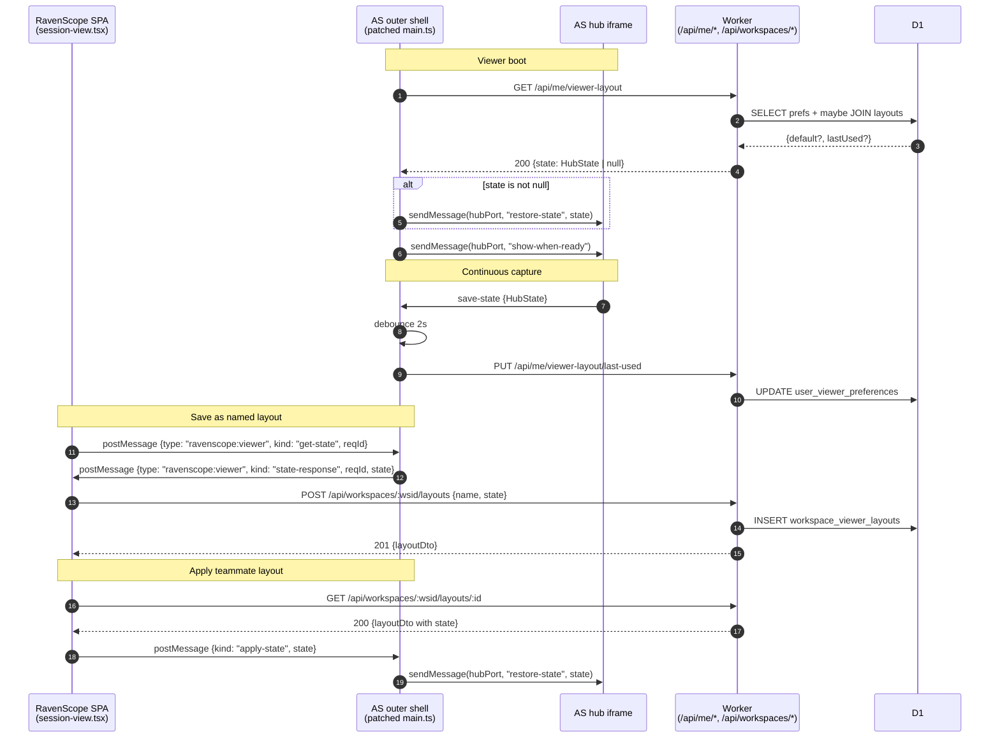

# feat: Shared viewer layouts + per-user default

## Overview

AdvantageScope Lite currently persists the viewer's HubState (sidebar +
tabs) to `localStorage` under key `AdvantageScopeLite/state`. That key
is scoped to the browser profile, so the same user on a new device,
incognito window, or after Safari ITP eviction lands on a blank default
layout — and layouts can't be shared between teammates at all. This is
the "sometimes remembered, sometimes not" behavior the user observed.

Move layout persistence to the RavenScope backend, on two axes:

1. **Workspace-shared named layouts.** Any workspace member can save a
   named layout, load a teammate's layout, rename, or delete. Drives
   consistent setups across coaches, students, and devices.
2. **Per-user last-used + explicit default.** Opening the viewer
   applies the user's chosen default (if set); otherwise applies the
   user's last-used state (captured continuously as they adjust the
   viewer); otherwise falls back to AS Lite's built-in default.

All state flows through one extension point — the existing
`packages/web/advantagescope/main.ts.patch`. The patch already
intercepts AS's boot flow for the `?log=` auto-open feature; we layer
layout read/write hooks into the same patch. No changes to AS's hub
source, no new iframe plumbing beyond the one postMessage channel we
need for "Save current layout" from the React chrome.

---

## Problem Frame

Today a user opening the viewer on a new device — or after browser
storage is evicted — sees a blank AS Lite configured with default tabs
and no field/robot selections. They have to rebuild "my usual setup"
from scratch. Teams share sessions but not *views of* sessions, so a
mentor who has tuned a nice odometry + joystick + 3D layout can't hand
it to a student. The fix is to persist layouts server-side, workspace-
scoped, and give each user a one-click "use this layout by default"
preference.

See adjacent context: `docs/plans/2026-04-23-003-feat-embed-advantagescope-plan.md`
(the embed foundation this builds on),
`docs/plans/2026-04-23-003-feat-workspace-members-plan.md` (workspace-
member auth posture we inherit).

---

## Requirements Trace

- R1. Any workspace member can save the current viewer layout as a
  named layout that all other workspace members can see and load.
- R2. Any workspace member can rename or delete any workspace layout
  (permission model: "any member" — matches how sessions and wpilogs
  are already shared).
- R3. Each user can pick one workspace layout as their default. When
  they open the viewer, that layout is applied automatically before
  the hub becomes visible.
- R4. When a user has no explicit default, the viewer restores their
  last-used layout state (continuously captured as they adjust the
  viewer) — across devices, browsers, and incognito sessions.
- R5. When neither default nor last-used exists (brand-new user), AS
  Lite boots with its own default and the viewer is usable without
  any prior setup.
- R6. No regression on the embed plan's auth posture: a non-member of
  a workspace receives 404 on every new endpoint, matching the
  existing `/api/sessions/*` policy. A user cannot read or write
  another workspace's layouts or another user's preferences.
- R7. The mechanism does not modify AS Lite's hub source; all
  RavenScope-owned behavior lives in `main.ts.patch` (the same patch
  file that handles `?log=` auto-open) and in RavenScope's own Worker
  + SPA code.

---

## Scope Boundaries

- Not building a public layout gallery or cross-workspace sharing.
  Layouts are workspace-scoped only.
- Not adding CRUD UI inside AS Lite itself (inside the iframe
  chrome). All RavenScope controls live in the SPA shell above the
  iframe. This preserves R7.
- Not persisting AS Lite's `preferences` or `type-memory`
  localStorage keys to the server — out of scope; only HubState
  (layout) is moved. Prefs are per-device concerns and changing that
  would be a larger UX decision.
- Not syncing layout changes live across multiple open tabs. If a
  user opens two viewer tabs, each captures its own last-used
  independently and last-write-wins. Real-time sync is deferred.
- Not surfacing audit events for layout create/rename/delete in v1
  (unlike invites/members). Low-risk data; re-add if a use case
  emerges.
- Not building a UI to *edit* a saved layout's state by hand. Users
  edit live in the viewer, then "save over" an existing layout.

### Deferred to Follow-Up Work

- **Audit logging** for layout mutations, consistent with the
  workspace-members pattern (`packages/worker/src/audit/log.ts`).
  Separate follow-up if needed.
- **Layout thumbnails / previews** in the picker. Would require
  offscreen rendering or a heuristic summary; defer.

---

## Context & Research

### Relevant Code and Patterns

- `packages/web/advantagescope/main.ts.patch` — our sole extension
  point into AS Lite's boot flow. Currently a 5-line addition that
  sends `open-files` via `hubPort` on `?log=<name>`. The layout
  hooks land in the same file.
- `~/src/1310/AdvantageScope/src/main/lite/main.ts:258-266` — boot
  sequence that reads `localStorage[AdvantageScopeLite/state]` and
  sends `restore-state` via `sendMessage(hubPort, "restore-state",
  …)`. This is the seam we replace with a server fetch.
- `~/src/1310/AdvantageScope/src/main/lite/main.ts:302-304` —
  `handleHubMessage` case `"save-state"` which currently only writes
  to `localStorage`. The patch adds a debounced PUT to RavenScope.
- `~/src/1310/AdvantageScope/src/shared/HubState.ts` — the typed
  shape (`{sidebar: {width, expanded[]}, tabs: {selected,
  tabs[{type, title, controller, controllerUUID, renderer,
  controlsHeight}]}}`). Bounded, JSON-round-trippable, small
  (kilobytes, not megabytes).
- `packages/worker/src/routes/workspace-members.ts` — the cross-
  tenancy-guarded route pattern (check `assertActiveWsid(user.
  workspaceId, paramWsid)`, return 403 `forbidden` on mismatch).
  Applied verbatim for layout CRUD.
- `packages/worker/src/routes/advantagescope.ts` — existing viewer
  route group at `/v`, already running `requireCookieUser` and
  `loadOwnedSession`. The patched outer frame fetches `/api/me/
  viewer-layout` directly (same-origin, cookie flows), not through
  `/v/:id/*`; no changes to this file.
- `packages/worker/src/db/schema.ts` — drizzle schema conventions:
  TEXT-UUID ids, INTEGER timestamp_ms, onDelete cascades (`cascade`
  for join tables, `restrict` for business data, `set null` for
  soft-loss references).
- `packages/worker/migrations/0002_workspace_members.sql` — hand-
  edited-after-drizzle-kit migration pattern; load-bearing ordering
  comments. The new migration follows this shape.
- `packages/worker/src/routes/workspace-members.ts:42-45` — the Hono
  sub-app shape (`new Hono<{ Bindings: Env }>()` then
  `routes.use("*", requireCookieUser)`).
- `packages/worker/src/dto.ts` — shared request/response DTOs
  between worker and web; extend with layout types.
- `packages/web/src/routes/session-view.tsx` — where the toolbar
  chrome menu (U4) slots in, above the iframe. Already queries
  session detail via react-query; the layout picker follows the same
  pattern.
- `packages/web/src/lib/api.ts` — `sessionViewerUrl(id)` and
  `fetchSessionDetail(id)` helpers; add parallel layout helpers.

### Institutional Learnings

- `docs/solutions/` does not exist yet (per embed plan); no prior
  entries applicable. Candidate learning from this work: "moving
  iframe localStorage state to server-owned storage via main.ts
  patch" — worth capturing post-ship.

### External References

- None needed. All extension points are already explored as part of
  the embed plan research. HubState is internal to AS; layout
  behavior is entirely RavenScope-controlled.

---

## Key Technical Decisions

- **Per-user preferences are 1:1 with (user, workspace), not 1:1
  with user.** Even though v1 has one workspace per user, the schema
  uses composite PK `(user_id, workspace_id)` so preferences don't
  silently leak when/if a user joins a second workspace later. Cheap
  future-proofing; matches how `workspace_members` is keyed.
- **Last-used state is stored on the preferences row, not as a
  separate "unnamed layout" record.** One row per `(user,
  workspace)` carries both the default layout foreign key and the
  last-used JSON blob. Rationale: last-used is not a shared entity,
  never shows up in the layout picker, and conflating it with named
  layouts would confuse the permission model (last-used is user-
  private, named layouts are workspace-shared).
- **`last_used_state_json` is TEXT nullable.** D1/SQLite TEXT has no
  practical upper bound for HubState-sized payloads; no need for
  BLOB. Null = user has never opened the viewer. Using a sentinel
  string is worse (forces parsing on empty state).
- **Default layout FK uses `onDelete: "set null"`**, not restrict or
  cascade. Deleting a layout another user has defaulted to should
  silently demote them to last-used/AS-default, not block the
  delete (would cause passive-aggressive coordination overhead) and
  not erase their last-used blob.
- **Unique constraint on `(workspace_id, name)`** for layouts. Same-
  name collisions within a workspace are confusing; force rename on
  409. Across workspaces, names are independent.
- **Debounced PUT of last-used.** AS Lite fires `save-state` on
  every sidebar resize, tab switch, field change — many times per
  second when a user is actively configuring. The patch batches
  these: after a save-state, wait 2 seconds of quiet before PUTting
  to `/api/me/viewer-layout/last-used`. In-flight request coalesces;
  on page unload, a `navigator.sendBeacon` flush captures the last
  change. Matches how most web apps handle autosave.
- **Server-authoritative read on boot; localStorage stops being the
  source of truth.** The patch replaces AS's `localStorage.getItem(
  AdvantageScopeLite/state)` read with a `fetch("/api/me/viewer-
  layout")` before `show-when-ready`. AS's own `save-state` handler
  still writes to localStorage (we leave that line alone as a cheap
  local-latest cache) but we no longer *read* it on boot. Removes
  the "sometimes remembered" surprise: the server is the truth.
- **Cross-frame state capture uses one postMessage channel.** The
  patch listens for `window.addEventListener("message", …)` filtered
  to same-origin and a namespaced envelope
  `{type: "ravenscope:viewer", …}`. Two message kinds: `get-state`
  (request/response with a `requestId`) and `state-response` (the
  reply). Keeps the contract small, discoverable, and unlikely to
  collide with anything AS Lite does natively. Origin check is
  `event.origin === window.location.origin` — same-origin parent
  only.
- **UI placement**: core flow (save, load, set-my-default) is a
  dropdown in the session-view header, because the user is looking
  at the layout when they want to save/load it. Secondary ops
  (rename, delete workspace-level) live in a modal opened from that
  dropdown's "Manage layouts…" option. No separate SPA route — a
  dedicated page would over-fragment for an action that is always
  taken in the context of the viewer.
- **No audit log in v1.** Layouts are low-stakes UI state. Re-add
  if an incident argues for it; the DTO shape already exposes
  `createdByUserId` so traceability is preserved inside the data.

---

## Open Questions

### Resolved During Planning

- **How does AS Lite persist layout today?** `localStorage` key
  `AdvantageScopeLite/state`. Confirmed in
  `~/src/1310/AdvantageScope/src/main/lite/localStorageKeys.ts:12`
  and the boot read at `main.ts:264`.
- **Is `localStorage` per-tab or per-origin?** Per-origin. Unlike
  `sessionStorage`, it persists across tabs. "Sometimes remembered"
  is therefore not a tab-isolation issue — it's incognito,
  cross-device, Safari ITP eviction, or storage quota evictions.
- **Can the outer AS shell reach `hubPort` cleanly?** Yes — we
  already do for `?log=` auto-open. The same port accepts
  `restore-state` messages; we reuse it.
- **Does the server-boot fetch add perceptible latency to viewer
  open?** The fetch is a small JSON GET against a D1-backed endpoint
  on the same Worker that's already handling `/v/:id/`. Expected <
  50 ms P95. AS Lite's hub iframe itself takes longer to initialize,
  so the fetch is hidden in the boot critical path. Quantified post-
  ship.
- **Do layouts ever carry PII?** No. `HubState` is sidebar widths,
  tab types/titles, and controller/renderer configuration — all UI
  state, no user-identifying data. Safe to share workspace-wide.
- **What happens when a user loads a teammate's layout that
  references a tab type the user's AS bundle doesn't support?** AS
  Lite already handles unknown tab types gracefully on `restore-
  state` (skips them). Not a scenario we need to guard against in
  the API.

### Deferred to Implementation

- **Exact debounce interval.** 2 s is the starting point; tune if
  users complain that their last change didn't save on a fast
  refresh. `sendBeacon` on unload is the safety net.
- **Maximum layout size.** Observe post-ship; if any layout exceeds
  (say) 256 KB we can harden with an explicit cap. HubState is
  bounded in shape, so pathological size is unlikely.
- **Import-from-localStorage migration UX.** Users with pre-shipped
  localStorage state will see a blank viewer on first post-deploy
  open (because the boot read path changes). Small one-time
  inconvenience. A "would you like to import your browser-remembered
  layout as a named workspace layout?" prompt is a nice-to-have;
  defer unless feedback demands it.
- **Reload-in-place behavior on default change.** When a user
  changes their default layout via the picker, do we immediately
  apply it to the live iframe, or require a page reload? Current
  plan: apply live via `restore-state` postMessage — but confirm
  AS's state-restore handler is idempotent mid-session during
  implementation.

---

## High-Level Technical Design

> *This illustrates the intended cross-frame and request flows and is
> directional guidance for review, not implementation specification.
> The implementing agent should treat it as context, not code to
> reproduce.*

---

## Implementation Units

- [ ] U1. **D1 schema + migration: workspace_viewer_layouts, user_viewer_preferences**

**Goal:** Two new tables with the indexes and FK behaviors that the
rest of the plan depends on. Drizzle schema plus hand-edited
migration following the `0002_workspace_members.sql` pattern.

**Requirements:** R1, R3, R4, R6.

**Dependencies:** None.

**Files:**
- Modify: `packages/worker/src/db/schema.ts` — add
  `workspaceViewerLayouts` and `userViewerPreferences` tables; add
  both to the exported `schema` bundle.
- Create: `packages/worker/migrations/0003_viewer_layouts.sql` —
  drizzle-generated, then hand-edited if needed.
- Create: `packages/worker/src/db/schema.test.ts` entry (if the
  repo has one) or extend existing schema tests; otherwise
  implicit-tested via the route tests in U2.

**Approach:**
- `workspace_viewer_layouts`:
  - `id TEXT PK` (uuid)
  - `workspace_id TEXT NOT NULL REFERENCES workspaces(id) ON DELETE
    CASCADE`
  - `name TEXT NOT NULL`
  - `state_json TEXT NOT NULL`
  - `created_by_user_id TEXT REFERENCES users(id) ON DELETE SET
    NULL`
  - `created_at INTEGER NOT NULL` (timestamp_ms)
  - `updated_at INTEGER NOT NULL` (timestamp_ms)
  - `UNIQUE(workspace_id, name)`
  - Index `(workspace_id, updated_at DESC)` to power the list view.
- `user_viewer_preferences`:
  - `user_id TEXT NOT NULL REFERENCES users(id) ON DELETE CASCADE`
  - `workspace_id TEXT NOT NULL REFERENCES workspaces(id) ON DELETE
    CASCADE`
  - `default_layout_id TEXT REFERENCES
    workspace_viewer_layouts(id) ON DELETE SET NULL`
  - `last_used_state_json TEXT` (nullable)
  - `updated_at INTEGER NOT NULL`
  - `PRIMARY KEY (user_id, workspace_id)`.
- Verify the drizzle-kit output; if it produces out-of-order FK
  statements or misses the partial-index idioms, hand-edit with a
  load-bearing comment (same pattern as 0002).

**Execution note:** Characterization-first on the drizzle
round-trip — generate the migration, run it against an empty local
D1, and confirm the resulting `sqlite_master` matches the intended
shape before wiring routes.

**Patterns to follow:**
- `packages/worker/src/db/schema.ts` for table declaration
  conventions.
- `packages/worker/migrations/0002_workspace_members.sql` for
  hand-edit-comment style and `--> statement-breakpoint`.

**Test scenarios:**
- Happy path: inserting a layout row and a prefs row, then deleting
  the layout, leaves the prefs row with `default_layout_id = NULL`.
  Covers R6 "no cross-delete cascade".
- Edge case: two layouts with the same `(workspace_id, name)`
  produce a UNIQUE constraint error.
- Edge case: deleting a workspace cascades both layouts and
  preferences rows for that workspace.
- Edge case: deleting a user cascades their preferences row but
  does not cascade the layouts they created — instead,
  `created_by_user_id` becomes NULL on the surviving rows.

**Verification:**
- Running `pnpm -F @ravenscope/worker db:migrate` on a fresh D1
  produces the two tables with all constraints visible in
  `sqlite_master`.
- Drizzle-typed inserts + selects compile without `any`.

---

- [ ] U2. **Worker routes: `/api/workspaces/:wsid/layouts` + `/api/me/viewer-layout`**

**Goal:** Two route groups covering workspace-scoped layout CRUD and
per-user preference get/put. Every route is auth-gated and workspace-
bounded. DTOs live in `dto.ts`.

**Requirements:** R1, R2, R3, R4, R6.

**Dependencies:** U1.

**Files:**
- Create: `packages/worker/src/routes/viewer-layouts.ts`
- Create: `packages/worker/src/routes/viewer-layouts.test.ts`
- Create: `packages/worker/src/routes/me-viewer-layout.ts`
- Create: `packages/worker/src/routes/me-viewer-layout.test.ts`
- Modify: `packages/worker/src/index.ts` — register both route
  groups alongside the existing `/api/workspaces` and `/api/*`
  entries.
- Modify: `packages/worker/src/dto.ts` — add `ViewerLayoutDto`,
  `ViewerLayoutsResponse`, `SaveViewerLayoutRequest`,
  `UpdateViewerLayoutRequest`, `ViewerLayoutBootstrap`
  (`{state: unknown | null, source: "default" | "last-used" |
  "none"}`), `UpdateViewerPreferencesRequest`.

**Approach:**
- `viewerLayoutsRoutes` mounted under `/api/workspaces`:
  - `GET  /:wsid/layouts` — list `{id, name, updatedAt,
    createdByUserId}[]` ordered by `updated_at DESC`.
  - `GET  /:wsid/layouts/:id` — full `{…, state}` payload.
  - `POST /:wsid/layouts` — `{name, state}` → 201; enforce the
    unique constraint as 409 `{error: "name_in_use"}`.
  - `PATCH /:wsid/layouts/:id` — `{name?, state?}`; either or
    both can update, both must be same-workspace-bounded, partial
    patch semantics.
  - `DELETE /:wsid/layouts/:id` — 204 on success.
  - All routes apply `assertActiveWsid(user.workspaceId, paramWsid)`
    and 403 on mismatch, identical to workspace-members.
  - All mutation routes additionally verify the workspace exists
    and the layout (where applicable) belongs to that workspace;
    cross-workspace IDs get 404.
- `meViewerLayoutRoutes` mounted under `/api/me` (new namespace;
  register alongside existing `/api/*`):
  - `GET /viewer-layout` → `ViewerLayoutBootstrap`. Selection
    order: user's `default_layout_id` state; else `last_used_state_
    json`; else `{state: null, source: "none"}`.
  - `PUT /viewer-layout/last-used` — body: `{state}`. Upsert the
    prefs row.
  - `PUT /viewer-preferences` — body: `{defaultLayoutId: string |
    null}`. Validate that the layout (if non-null) exists in the
    user's workspace; 404 otherwise. Upsert.
- Response-body size cap: reject PUT/POST with a `state` whose
  JSON stringified length exceeds a conservative `256 KiB` with
  a 413 `{error: "payload_too_large"}`. Sanity guard; HubState
  is far smaller in practice.

**Execution note:** Integration tests first. Cover the cross-
tenancy matrix (user from ws A touching ws B's layout) before
writing handler bodies — that's where R6 lives.

**Patterns to follow:**
- `packages/worker/src/routes/workspace-members.ts` — the sub-app
  shape, the `requireCookieKind(user) + assertActiveWsid` pattern,
  and DTO placement.
- `packages/worker/src/routes/api-keys.ts` for workspace-scoped
  CRUD cadence (if present) or the members file if not.

**Test scenarios:**
- Happy path (R1): authenticated user A in workspace W1 → POST
  `/api/workspaces/W1/layouts` {name: "Coach view", state} returns
  201 with the DTO; GET `/api/workspaces/W1/layouts` returns the
  new row in the listing.
- Happy path (R2): user B (different user, same workspace W1)
  → PATCH the name of A's layout succeeds; DELETE succeeds.
- Happy path (R3): PUT `/api/me/viewer-preferences`
  {defaultLayoutId: <id>} → 200; subsequent GET
  `/api/me/viewer-layout` returns `{state: <the layout's state>,
  source: "default"}`.
- Happy path (R4): PUT `/api/me/viewer-layout/last-used` {state:
  S}; GET `/api/me/viewer-layout` returns `{state: S, source:
  "last-used"}` when no default is set.
- Happy path (R5): user has no prefs row and no last-used state
  → GET returns `{state: null, source: "none"}`.
- Edge case: duplicate name in same workspace → 409
  `{error: "name_in_use"}`.
- Edge case: PATCH with empty body (no `name`, no `state`) → 400
  `{error: "no_fields"}`.
- Edge case: PUT last-used with a state exceeding 256 KiB → 413.
- Error path (R6): user in workspace W1 attempts GET
  `/api/workspaces/W2/layouts/<id>` where `<id>` belongs to W2 →
  403 `{error: "forbidden"}` on wsid mismatch.
- Error path (R6): user sets `defaultLayoutId` to a layout id
  that belongs to a different workspace → 404
  `{error: "not_found"}`.
- Error path (R6): unauthenticated request to any endpoint →
  redirect to sign-in (matches existing `/api/*` cookie-auth
  posture).
- Edge case: deleting a layout that several users have defaulted
  to → all those users' `default_layout_id` become NULL; their
  next viewer boot falls back to last-used (verified via a
  subsequent GET of `/api/me/viewer-layout` for one of the
  affected users).
- Integration: running the existing auth-matrix helper across
  every route shape produces the expected 401/403/404 outcomes.

**Verification:**
- `pnpm -F @ravenscope/worker test` green.
- `curl` matrix covers the cross-tenancy, 404, 409, 413 cases
  end-to-end against a local wrangler dev.

---

- [ ] U3. **`main.ts.patch` additions: boot fetch, debounced last-used PUT, get-state postMessage responder**

**Goal:** Extend the existing patch so the AS outer shell loads a
user's layout from RavenScope on boot, writes last-used on save-
state (debounced), and answers the SPA's "what's your current
state?" postMessage.

**Requirements:** R3, R4, R5, R7.

**Dependencies:** U2 (endpoints must exist).

**Files:**
- Modify: `packages/web/advantagescope/main.ts.patch` — grow the
  current 5-line patch to ~50–70 lines covering boot, save, and
  the postMessage handler.
- Modify: `packages/web/scripts/publish-advantagescope-bundle.mjs`
  — no change expected; the patch-apply step already runs.
- No new files on the RavenScope side; the patch is applied during
  the dev publish ritual.

**Approach:**
- **Boot replacement**: around AS's `main.ts:264-265`, replace the
  synchronous `localStorage.getItem(LocalStorageKeys.STATE)` read
  with an `await`ed `fetch("/api/me/viewer-layout", { credentials:
  "same-origin" })`. On non-OK or network error, fall back to the
  localStorage read (so the feature degrades gracefully if the
  endpoint is misbehaving). On success and non-null state,
  `sendMessage(hubPort, "restore-state", state)`. The
  `show-when-ready` message remains the last boot step.
- **save-state hook**: next to the existing `save-state` case at
  `main.ts:302-304`, keep the localStorage write (cheap local cache)
  and add a module-scoped debounced function that POSTs
  `/api/me/viewer-layout/last-used` after 2 s of quiet. Cache the
  latest `message.data` in a module-scoped variable
  (`lastCapturedState`) so the postMessage responder (next point)
  can answer without a round-trip to the hub.
- **Unload flush**: register `window.addEventListener("pagehide",
  …)` that calls `navigator.sendBeacon("/api/me/viewer-layout/
  last-used", Blob)` with the latest `lastCapturedState`.
  Fire-and-forget; safe to fail.
- **postMessage handler**: `window.addEventListener("message", …)`
  filtered to `event.origin === window.location.origin`. Two
  message kinds in the `"ravenscope:viewer"` namespace:
  - `get-state`: reply with the latest `lastCapturedState` via
    `event.source.postMessage({type: "ravenscope:viewer", kind:
    "state-response", reqId, state})`.
  - `apply-state {state}`: `sendMessage(hubPort, "restore-state",
    state)` directly — used by U4's "Load layout" flow for a live
    swap without reload.
- **Namespacing**: every envelope carries `type:
  "ravenscope:viewer"` so AS's own internal postMessages (if any
  from the hub iframe) are ignored by our listener.

**Execution note:** Characterization-first on the existing patch's
semantics — write a test (or local repro) that confirms the
current `?log=` behavior still works after the patch grows, before
layering new hooks. The patch is the one piece of AS-adjacent code
we own, and a regression here silently breaks the embed.

**Technical design:** *(directional guidance — the handler shape,
not implementation spec)*

    // inside initHub(), after the existing ?log= block
    let lastCapturedState: unknown | null = null
    let pendingPutTimer: Timer | null = null

    const PUT_DEBOUNCE_MS = 2000
    async function flushLastUsed(state) {
      await fetch("/api/me/viewer-layout/last-used", {
        method: "PUT",
        credentials: "same-origin",
        headers: { "content-type": "application/json" },
        body: JSON.stringify({ state }),
      }).catch(() => {}) // last-used is best-effort; never fatal
    }
    function schedulePut() {
      if (pendingPutTimer) clearTimeout(pendingPutTimer)
      pendingPutTimer = setTimeout(() => flushLastUsed(lastCapturedState),
                                   PUT_DEBOUNCE_MS)
    }

    // boot: replace the localStorage state read with a fetch
    try {
      const res = await fetch("/api/me/viewer-layout",
                              { credentials: "same-origin" })
      if (res.ok) {
        const { state } = await res.json()
        if (state) sendMessage(hubPort, "restore-state", state)
      } else {
        // graceful degrade: fall back to existing localStorage path
      }
    } catch { /* same graceful degrade */ }

    // hook into save-state case: cache + schedule
    lastCapturedState = message.data
    schedulePut()

    // postMessage listener and pagehide beacon (elided)

**Patterns to follow:**
- Existing `?log=` patch (same file): short, comment-heavy,
  preserves upstream diff stability (so our patch continues to
  apply on AS tag bumps).

**Test scenarios:**
- Happy path (R3 + R4): smoke-test locally — open the viewer in a
  browser; verify that changing a tab, reloading, and reopening
  restores the new layout via the server (inspect Network tab for
  the `viewer-layout` GET on boot).
- Happy path (R5): fresh user with empty prefs → viewer boots
  without a `restore-state` call; AS's default UI is visible.
- Edge case: `/api/me/viewer-layout` returns 5xx → patch falls
  back to localStorage read; viewer still boots.
- Edge case: user edits the layout rapidly (5 changes in 1 s) →
  exactly one PUT fires ~2 s after the last change (verified via
  Network tab timing).
- Edge case: page unload during pending debounce → `sendBeacon`
  fires with the latest state.
- Integration (R7): running the full publish-advantagescope-bundle
  ritual with the expanded patch still produces a working tarball;
  the `?log=<id>.wpilog` auto-open still works.
- Edge case: a postMessage from a non-same-origin window (e.g.,
  someone opening devtools and posting) is ignored — `event.origin`
  check is strict equality.

**Verification:**
- A bump of the RavenScope bundle tag to `-rs3` publishes, fetches,
  and extracts without regression.
- Viewer opens on a fresh browser profile with an empty server
  state → AS default UI.
- Viewer opens on a browser profile where the user has a default
  set → default applied before hub visible.
- Network tab on rapid edits shows a single PUT per quiet period.

---

- [ ] U4. **Session-view toolbar: Save / Load / Set-my-default dropdown**

**Goal:** Wire the user-facing layout flow into the session-view
header chrome. Dropdown with actions that go through the U2 API and
the U3 postMessage bridge.

**Requirements:** R1, R3, R4.

**Dependencies:** U2, U3.

**Files:**
- Modify: `packages/web/src/routes/session-view.tsx` — header
  additions; wire react-query + iframe postMessage.
- Create: `packages/web/src/routes/session-view.test.tsx` — extend
  the existing file with new test cases (Save, Load, Set default).
- Create: `packages/web/src/lib/viewer-layouts.ts` — fetch/mutate
  helpers (`listLayouts`, `getLayout`, `saveLayout`, `updateLayout`,
  `deleteLayout`, `fetchViewerPreferences`, `setDefaultLayout`) +
  the `captureCurrentState(iframe)` helper that wraps the
  postMessage round-trip.
- Modify: `packages/web/src/lib/api.ts` — re-export from the new
  helpers module.

**Approach:**
- Dropdown component (use `@radix-ui/react-dropdown-menu`, already
  a dep) with five top-level items:
  - **Save current as new layout…** — prompts for a name (inline
    Dialog from `@radix-ui/react-dialog`), then
    `captureCurrentState(iframe)` → POST.
  - **Save current over…** — submenu listing workspace layouts;
    clicking one confirms overwrite, then `captureCurrentState` →
    PATCH.
  - **Load layout…** — submenu listing layouts; clicking fetches
    the state and sends via iframe postMessage
    `{kind: "apply-state", state}`.
  - **Set as my default** — submenu listing layouts; clicking PUTs
    `defaultLayoutId`.
  - **Manage layouts…** — opens the management modal (U5).
- `captureCurrentState(iframe)`:
  - Generate a short random `reqId`.
  - `iframe.contentWindow.postMessage({type: "ravenscope:viewer",
    kind: "get-state", reqId}, window.location.origin)`.
  - Attach a temporary `message` listener matching the envelope +
    `reqId`; resolve with `state`. Timeout after 3 s → reject
    (user-visible error toast).
- Disable the dropdown until the iframe's `load` event fires, so
  the postMessage handler is registered on the other side.
- React-query cache keys: `["viewer-layouts", workspaceId]`,
  `["viewer-layouts", workspaceId, layoutId]`, `["viewer-prefs"]`.
  Invalidate on mutation.

**Execution note:** For the postMessage round-trip, write the test
first (Vitest with a jsdom postMessage harness) — this is the
piece most likely to race or silently fail in production.

**Patterns to follow:**
- `packages/web/src/routes/session-detail.tsx` — dropdown + dialog
  cadence for the action menu.
- `packages/web/src/lib/api.ts` — existing fetch-wrapper
  conventions (`credentials: "same-origin"`, typed responses,
  thrown errors).

**Test scenarios:**
- Happy path (R1): click "Save current as new layout", enter
  name "Test", confirm; mocked POST receives the captured state;
  dropdown's "Load" submenu now lists "Test".
- Happy path (R3): click "Set as my default" → "Test"; mocked
  PUT fires; subsequent GET of viewer-prefs returns `"Test"` as
  the default.
- Happy path: click "Load layout" → "Test"; iframe postMessage
  fires with `apply-state`; mocked iframe receiver confirms the
  payload.
- Edge case: 3 s postMessage timeout on state capture → error
  toast shown; no POST fired.
- Edge case: 409 on save-as-new (name collision) → inline error
  "Name already in use"; dialog stays open for user to rename.
- Integration: iframe not yet loaded → dropdown is disabled;
  after `onLoad`, items become clickable.

**Verification:**
- Vitest suite green.
- Manual QA: the full flow (save new → reload page → viewer
  opens with last-used → load a layout → set a default → reload →
  default applied) works end-to-end against a local wrangler +
  vite dev server.

---

- [ ] U5. **Manage layouts modal: rename + delete**

**Goal:** Secondary flow for renaming and deleting workspace
layouts. Lives in a modal opened from U4's dropdown.

**Requirements:** R2.

**Dependencies:** U2, U4.

**Files:**
- Create: `packages/web/src/components/ManageLayoutsDialog.tsx`
- Create: `packages/web/src/components/ManageLayoutsDialog.test.tsx`
- Modify: `packages/web/src/routes/session-view.tsx` — host the
  dialog instance, open from dropdown.

**Approach:**
- Dialog shows a table: layout name, last-updated date, creator
  email (from the embed plan's existing `/api/me` or via a new
  enrichment — decide during implementation).
- Each row has an inline-edit rename affordance and a delete
  button with a second-click confirmation pattern (to avoid a
  modal-in-modal cascade).
- Rename collision (409) surfaces inline under the input.
- Delete confirmation is a second click on the same row within
  ~3 s; the label changes to "Confirm delete". Simpler than a
  nested confirm dialog.
- After rename/delete, invalidate `["viewer-layouts",
  workspaceId]` in react-query so the parent dropdown's list
  refreshes.

**Execution note:** None. Standard forms-over-tables UI against
existing endpoints.

**Patterns to follow:**
- `packages/web/src/routes/workspace-settings.tsx` — the members-
  table CRUD pattern; inline rename + confirm-delete is already
  used for something similar.
- `@radix-ui/react-dialog` — existing usage elsewhere in the SPA.

**Test scenarios:**
- Happy path (R2): rename "Old" → "New" → table updates;
  subsequent GET shows "New"; 409 on collision surfaces inline.
- Happy path (R2): delete "My layout" → 2-click confirmation →
  204; layout disappears from the table.
- Edge case: the layout was another user's default → delete
  still succeeds (server-side `onDelete: set null`); that user's
  default silently demotes. Confirmed by a second test that
  checks their `viewer-prefs` post-delete.
- Edge case: deleting the layout the current user has set as
  their default → their default clears immediately (follow-up
  GET returns `defaultLayoutId: null`).
- Edge case: the manage dialog opens while a save-from-dropdown
  operation is in flight → both converge on the same
  react-query cache after invalidation.

**Verification:**
- Vitest suite green.
- Manual QA: open manage, rename a layout, close; open
  dropdown, confirm the new name shows in every submenu.

---

## System-Wide Impact

- **Interaction graph:** Two new Worker route groups
  (`/api/workspaces/:wsid/layouts`, `/api/me/viewer-*`) that reuse
  `requireCookieUser` and the workspace-scoped guard pattern from
  workspace-members. Patched AS outer shell gains one
  `fetch()` on boot and one debounced `fetch()` per save-state
  burst; both are same-origin and carry the session cookie. The
  session-view React chrome adds one postMessage channel to the
  iframe (`ravenscope:viewer` namespace).
- **Error propagation:** Boot-fetch failure degrades gracefully to
  AS's own localStorage read path (the patch keeps the fallback).
  Last-used PUT failure is silently retried on the next save-state;
  one missed PUT loses <2 s of captured state. Management
  endpoints surface the conventional 400/403/404/409/413 shapes
  for UI handling.
- **State lifecycle risks:** `default_layout_id` can become stale
  when the referenced layout is deleted — handled by FK `set
  null`, with the UI demoting to last-used on the next boot.
  `last_used_state_json` is per-(user, workspace); if we ever
  merge workspaces in the future, that row becomes ambiguous —
  noted as a deferred concern, not a v1 blocker.
- **API surface parity:** The embed plan's `/v/:id/*` route group
  is unchanged. The new `/api/me/viewer-*` namespace is the first
  `/api/me/*` surface in the repo; it follows the same cookie-
  auth contract as `/api/workspaces/*`.
- **Integration coverage:** U4's postMessage-round-trip test is
  the primary integration surface between the SPA and the
  patched iframe. U3's publish-ritual end-to-end check verifies
  the enlarged patch still applies against the pinned AS tag.
- **Unchanged invariants:** AS Lite's hub source; the session-
  view iframe sandbox (`allow-scripts allow-same-origin`); the
  existing `/v/:id/*` auth model; R2 I/O posture.

---

## Risks & Dependencies

| Risk | Mitigation |
|------|------------|
| AS Lite's `restore-state` applied mid-session causes visible churn or drops user input | First-load flow only triggers restore-state before `show-when-ready`; the live "Load layout" path (U4) reuses the same message but must be validated for mid-session safety during U4 implementation. If churn is observable, fall back to requiring a reload on live load. |
| The enlarged `main.ts.patch` fails to apply on a future AS tag bump (line drift) | The patch is scoped to `initHub()` and the `save-state` case, both already stable in AS's architecture. If apply fails, the publish ritual surfaces the error; maintenance cost is re-anchoring the hunk, not rewriting logic. |
| Name collision storms when many members save the same canonical name ("My layout") | UI disambiguates with a clear 409 path ("Name already in use"). Unique constraint is per-workspace, not per-user, by design — teams want visibility into each other's named layouts. |
| Server is the only source of truth for layout; a Worker outage makes the viewer fall back to local state | The patch's graceful-degrade path uses AS's own localStorage as a fallback on boot-fetch failure, so a transient outage reverts to today's behavior rather than breaking the viewer. |
| A layout payload approaches D1's SQLite TEXT practical limits | 256 KiB guard in U2 rejects pathological uploads. HubState in practice is sub-10 KiB; the cap is a sanity net, not an expected constraint. |
| Cross-origin postMessage interception (e.g., someone embeds RavenScope in an outer site) | U3 filters on `event.origin === window.location.origin`. The embed plan's iframe sandbox already restricts `allow-scripts allow-same-origin` only, so the parent-frame listener and the outer-shell listener are symmetric. |
| Last-used PUT fires on every tiny sidebar resize, flooding the Worker | 2 s debounce in U3 collapses bursts. `pagehide` beacon catches the final state. Monitor post-ship for PUT rate; tighten if noisy. |
| Users on shared computers accidentally share last-used state across accounts | `last_used_state_json` is keyed by authenticated user, not by browser. A shared computer with separate logins produces separate last-used rows; the "sometimes remembered" bug itself becomes the safer default here. |

---

## Documentation / Operational Notes

- **README.md:** add a short "Shared viewer layouts" subsection
  near the AS embed section, explaining that layouts are
  workspace-shared and that each user can pick a default.
- **Runbook:** no new on-call surface. D1 writes are small and
  bounded by the 256 KiB guard; R2 is untouched.
- **Monitoring:** no new dashboards. The PUT rate on
  `/api/me/viewer-layout/last-used` is a quiet regression signal
  — watch for it trending toward the debounce interval (i.e.,
  the debounce is not working).
- **Rollout:** additive. Deploy the Worker + migration first; the
  SPA's new endpoints no-op if called before the Worker is
  updated (404 is the graceful-degrade path in U3). The enlarged
  `main.ts.patch` ships via the next bundle tag bump (e.g.,
  `-rs3`) — same ritual as the 2026-field-asset plan's U2.
- **Feature flag:** none needed. If a regression surfaces, revert
  the `main.ts.patch` additions by rolling the bundle tag back
  to `-rs2`; the Worker routes become dead code until the patch
  returns.

---

## Sources & References

- **Adjacent plans:**
  - [docs/plans/2026-04-23-003-feat-embed-advantagescope-plan.md](./2026-04-23-003-feat-embed-advantagescope-plan.md)
    — the embed foundation; `main.ts.patch` posture, route group
    style, `/v/:id/*` auth model, iframe sandbox.
  - [docs/plans/2026-04-23-003-feat-workspace-members-plan.md](./2026-04-23-003-feat-workspace-members-plan.md)
    — cross-tenancy auth patterns, migration style, DTO conventions.
  - [docs/plans/2026-04-24-001-feat-add-2026-field-assets-plan.md](./2026-04-24-001-feat-add-2026-field-assets-plan.md)
    — bundle-tag bump ritual (the `-rsN` convention U3 follows).
- **Upstream AdvantageScope (external, not vendored):**
  - `~/src/1310/AdvantageScope/src/main/lite/main.ts:258-266,
    302-304` — state save/restore seams we hook into.
  - `~/src/1310/AdvantageScope/src/main/lite/localStorageKeys.ts:12`
    — `AdvantageScopeLite/state` key definition.
  - `~/src/1310/AdvantageScope/src/shared/HubState.ts` — typed
    shape of the layout payload.
- **Related RavenScope code:**
  - `packages/worker/src/routes/workspace-members.ts` — auth
    pattern reference.
  - `packages/worker/src/routes/advantagescope.ts` — unchanged by
    this plan.
  - `packages/worker/src/db/schema.ts` — extended by U1.
  - `packages/web/src/routes/session-view.tsx` — extended by U4.
  - `packages/web/advantagescope/main.ts.patch` — extended by U3.
